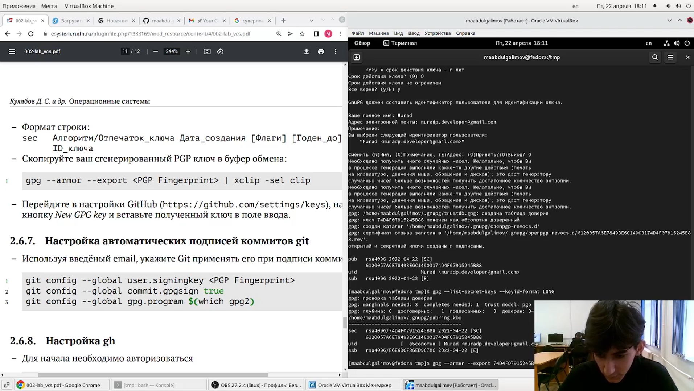
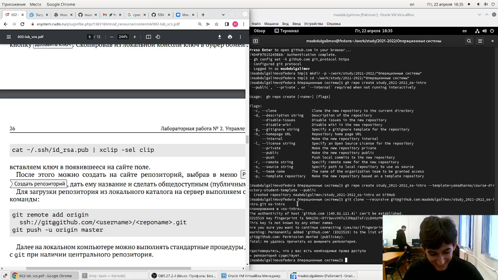

---
## Front matter
lang: ru-RU
title: Презентация по лабораторной работе № 3
author: Абдулгалимов Мурад
	Leonid A. Sevastianov\inst{1,3}
	\and
	Anton L. Sevastianov\inst{1}
	\and
	Edik A. Ayrjan\inst{2}
	\and
	Anna V. Korolkova\inst{1}
	\and
	Dmitry S. Kulyabov\inst{1,2}
	\and
	Imrikh Pokorny\inst{4}
institute: |
	\inst{1}RUDN University, Moscow, Russian Federation
	\and
	\inst{2}LIT JINR, Dubna, Russian Federation
	\and
	\inst{3}BLTP JINR, Dubna, Russian Federation
	\and
	\inst{4}Technical University of Košice, Košice, Slovakia
date: NEC--2019, 30 September -- 4 October, 2019 Budva, Montenegro

## Formatting
toc: false
slide_level: 2
theme: metropolis
header-includes: 
 - \metroset{progressbar=frametitle,sectionpage=progressbar,numbering=fraction}
 - '\makeatletter'
 - '\beamer@ignorenonframefalse'
 - '\makeatother'
aspectratio: 43
section-titles: true
---

---

# Цель работы

* Изучить идеологию и применение средств контроля версий.

* Освоить умения по работе с git.

---

---

# Задание

Составить отчет по прошлой лабораторной работе на языке разметки markdown.


---

---

## 1. Создал учетную запись и заполнил основные данные
(рис. [-@fig:001;-@fig:002]):

{ #fig:001 width=70% }

{ #fig:002 width=70% }

---

---

## 2. Установил git-flow в Fedora Linux(рис. [-@fig:003]):
Команды:
```
cd /tmp
wget --no-check-certificate -q https://raw.github.com/petervanderdoes/gitflow/develop/contrib/gitflow-installer.sh
chmod +x gitflow-installer.sh
sudo ./gitflow-installer.sh install stable
```

{#fig:003 width=70%}

---

---

## 3. Провел базовую настройку Git(рис. [-@fig:005]):
Команды:
```
git config --global user.name "Name Surname"
git config --global user.email "work@mail"
git config --global core.quotepath false
```

{#fig:005 width=70%}

---

---

## 4. Создал ключи SSH и PGP(рис. [-@fig:006], [-@fig:007]):
Команды:
```
ssh-keygen -t rsa -b 4096
ssh-keygen -t ed25519
```

{#fig:006 width=70%}

{#fig:007 width=70%}

---

---

## 5. Добавление PGP в GitHub(рис. [-@fig:008]):
Команды:
```
gpg --list-secret-keys --keyid-format LONG
gpg --armor --export <PGP Fingerprint> | xclip
```

{#fig:008 width=70%}

---

---

## 6. Настроил автоматические подписи для комитов Git(рис. [-@fig:010]):
Команды:
```
git config --global user.signingkey <PGP Fingerprint>
git config --global commit.gpgsign true
git config --global gpg.program $(which gpg2)
```
{#fig:010 width=70%}

---

---

## 7. Создание репозитория курса на основе шаблона(рис. [-@fig:012]):
Команды:
```
mkdir -p ~/work/study/2021-2022/"Операционные системы"
cd ~/work/study/2021-2022/"Операционные системы"
gh repo create study_2021-2022_os-intro--template=yamadharma/course-directory-student-template --public
git clone --recursivegit@github.com:<owner>/study_2021-2022_os-intro.git os-intro
```

{#fig:012 width=70%}

---

---

## 8. Настроил каталог курса и отправил на сервер(рис. [-@fig:013]):
Команды: 
```
cd ~/work/study/2021-2022/"Операционные системы"/os-intro
rm package.json
make COURSE=os-intro
git add .
git commit -am 'feat(main): make course structure'
git push
```

{#fig:013 width=70%}

---

---

# Выводы:

* Изучил идеологию и применение средств контроля версий.
* Освоил умения по работе с git.

---