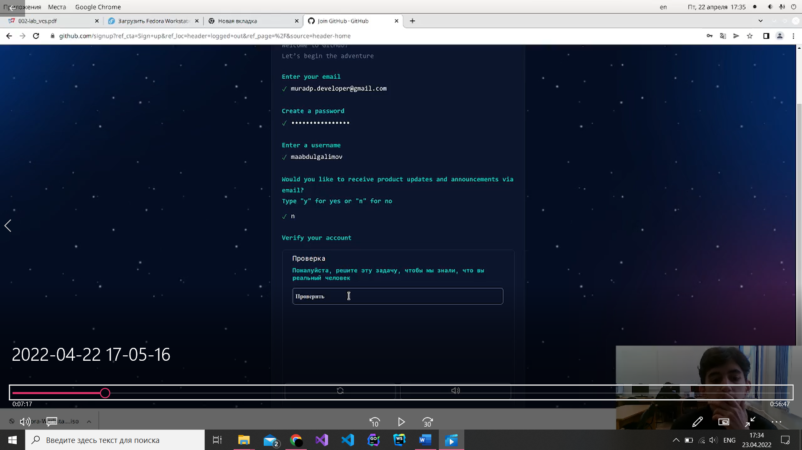
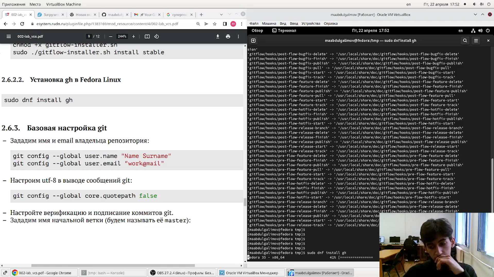
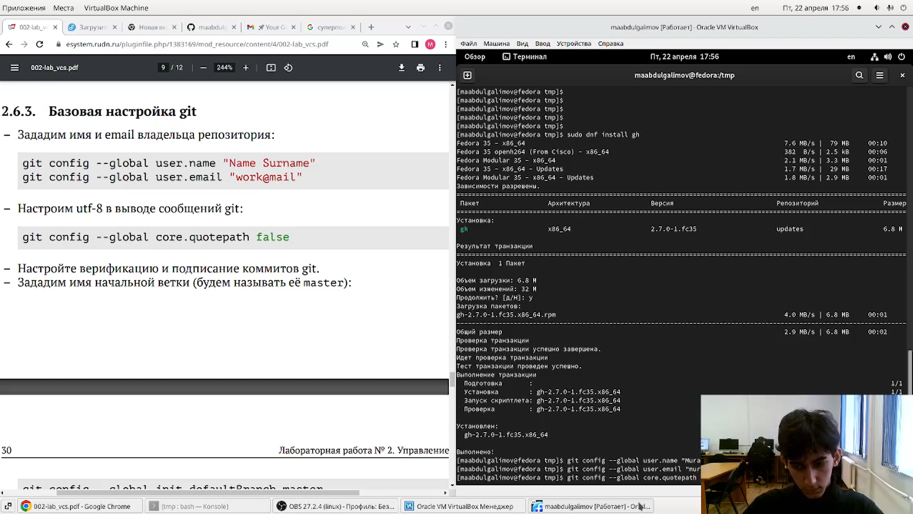
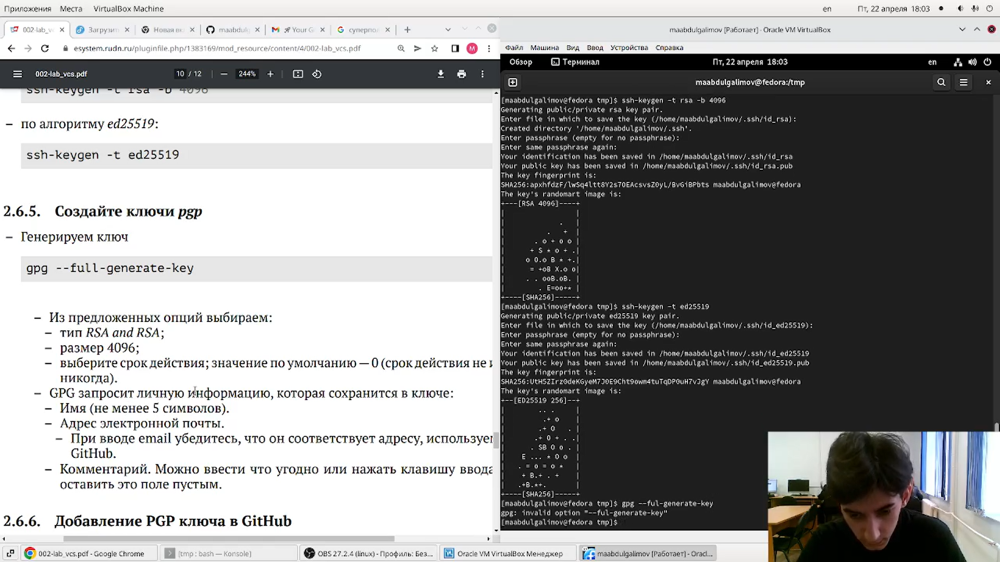
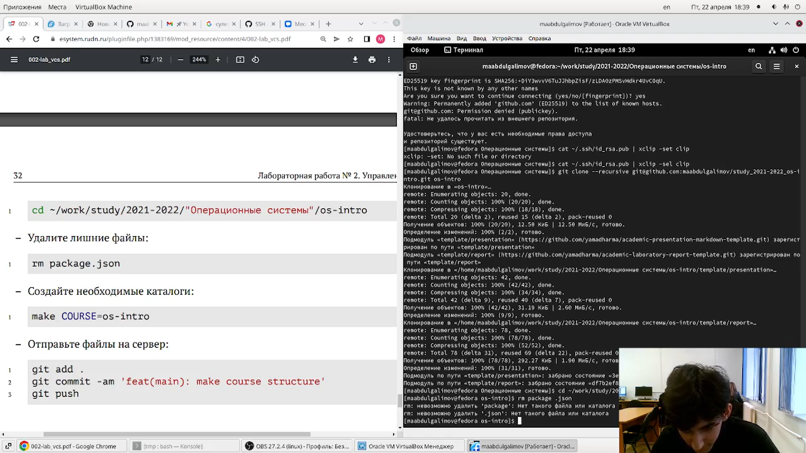

---
## Front matter
title: "Отчет по лабораторной работе № 2"
subtitle: "Российский университет дружбы народов"
author: "Абдулгалимов Мурад Арсенович"

## Generic otions
lang: ru-RU
toc-title: "Содержание"

## Bibliography
bibliography: bib/cite.bib
csl: pandoc/csl/gost-r-7-0-5-2008-numeric.csl

## Pdf output format
toc: true # Table of contents
toc-depth: 2
lof: true # List of figures
lot: true # List of tables
fontsize: 12pt
linestretch: 1.5
papersize: a4
documentclass: scrreprt
## I18n polyglossia
polyglossia-lang:
  name: russian
  options:
	- spelling=modern
	- babelshorthands=true
polyglossia-otherlangs:
  name: english
## I18n babel
babel-lang: russian
babel-otherlangs: english
## Fonts
mainfont: PT Serif
romanfont: PT Serif
sansfont: PT Sans
monofont: PT Mono
mainfontoptions: Ligatures=TeX
romanfontoptions: Ligatures=TeX
sansfontoptions: Ligatures=TeX,Scale=MatchLowercase
monofontoptions: Scale=MatchLowercase,Scale=0.9
## Biblatex
biblatex: true
biblio-style: "gost-numeric"
biblatexoptions:
  - parentracker=true
  - backend=biber
  - hyperref=auto
  - language=auto
  - autolang=other*
  - citestyle=gost-numeric
## Pandoc-crossref LaTeX customization
figureTitle: "Рис."
tableTitle: "Таблица"
listingTitle: "Листинг"
lofTitle: "Список иллюстраций"
lotTitle: "Список таблиц"
lolTitle: "Листинги"
## Misc options
indent: true
header-includes:
  - \usepackage{indentfirst}
  - \usepackage{float} # keep figures where there are in the text
  - \floatplacement{figure}{H} # keep figures where there are in the text
---

# Цель работы

* Изучить идеологию и применение средств контроля версий.

* Освоить умения по работе с git.

# Задание

Составить отчет по прошлой лабораторной работе на языке разметки markdown.

# Теоретическое введение

Здесь описываются теоретические аспекты, связанные с выполнением работы.

Например, в табл. [-@tbl:std-dir] приведено краткое описание стандартных каталогов Unix.

: Описание некоторых каталогов файловой системы GNU Linux {#tbl:std-dir}

| Имя каталога | Описание каталога                                                                                                          |
|--------------|----------------------------------------------------------------------------------------------------------------------------|
| `/`          | Корневая директория, содержащая всю файловую                                                                               |
| `/bin `      | Основные системные утилиты, необходимые как в однопользовательском режиме, так и при обычной работе всем пользователям     |
| `/etc`       | Общесистемные конфигурационные файлы и файлы конфигурации установленных программ                                           |
| `/home`      | Содержит домашние директории пользователей, которые, в свою очередь, содержат персональные настройки и данные пользователя |
| `/media`     | Точки монтирования для сменных носителей                                                                                   |
| `/root`      | Домашняя директория пользователя  `root`                                                                                   |
| `/tmp`       | Временные файлы                                                                                                            |
| `/usr`       | Вторичная иерархия для данных пользователя                                                                                 |

Более подробно об Unix см. в [@gnu-doc:bash;@newham:2005:bash;@zarrelli:2017:bash;@robbins:2013:bash;@tannenbaum:arch-pc:ru;@tannenbaum:modern-os:ru].

# Выполнение лабораторной работы

## 1. Создал учетную запись и заполнил основные данные
(рис. [-@fig:001;-@fig:002]):

{ #fig:001 width=70% }

{ #fig:002 width=70% }

## 2. Установил git-flow в Fedora Linux(рис. [-@fig:003], [-@fig:004]):
Команды:
```
cd /tmp
wget --no-check-certificate -q https://raw.github.com/petervanderdoes/gitflow/develop/contrib/gitflow-installer.sh
chmod +x gitflow-installer.sh
sudo ./gitflow-installer.sh install stable
```

{#fig:003 width=70%}

{#fig:004 width=70%}

## 3. Провел базовую настройку Git(рис. [-@fig:005]):
Команды:
```
git config --global user.name "Name Surname"
git config --global user.email "work@mail"
git config --global core.quotepath false
```

{#fig:005 width=70%}

## 4. Создал ключи SSH и PGP(рис. [-@fig:006], [-@fig:007]):
Команды:
```
ssh-keygen -t rsa -b 4096
ssh-keygen -t ed25519
```

{#fig:006 width=70%}

{#fig:007 width=70%}

## 5. Добавление PGP в GitHub(рис. [-@fig:008], [-@fig:009]):
Команды:
```
gpg --list-secret-keys --keyid-format LONG
gpg --armor --export <PGP Fingerprint> | xclip
```

{#fig:008 width=70%}

{#fig:009 width=70%}

## 6. Настроил автоматические подписи для комитов Git(рис. [-@fig:010], [-@fig:011]):
Команды:
```
git config --global user.signingkey <PGP Fingerprint>
git config --global commit.gpgsign true
git config --global gpg.program $(which gpg2)
```
{#fig:010 width=70%}

{ #fig:011 width=70% }

## 7. Создание репозитория курса на основе шаблона(рис. [-@fig:012]):
Команды:
```
mkdir -p ~/work/study/2021-2022/"Операционные системы"
cd ~/work/study/2021-2022/"Операционные системы"
gh repo create study_2021-2022_os-intro--template=yamadharma/course-directory-student-template --public
git clone --recursivegit@github.com:<owner>/study_2021-2022_os-intro.git os-intro
```

{#fig:012 width=70%}

## 8. Настроил каталог курса и отправил на сервер(рис. [-@fig:013]):
Команды: 
```
cd ~/work/study/2021-2022/"Операционные системы"/os-intro
rm package.json
make COURSE=os-intro
git add .
git commit -am 'feat(main): make course structure'
git push
```

{#fig:013 width=70%}

## Контрольные вопросы:

### 1. Системы контроля версий — это программные инструменты, 
помогающие командам разработчиков управлять изменениями 
в исходном коде с течением времени. Системы контроля версий 
(Version Control System, VCS) применяются при работе 
нескольких человек над одним проектом.

### 2. Объясните следующие понятия VCS и их отношения: 
хранилище, commit, история, рабочая копия.
Хранилище – репозиторий - место хранения всех версий и 
служебной информации.
Commit - это команда для записи индексированных изменений в 
репозиторий.
История – место, где сохраняются все коммиты, по которым 
можно посмотреть данные о коммитах.
Рабочая копия – текущее состояние файлов проекта, основанное 
на версии, загруженной из хранилища.

### 3. Что представляют собой и чем отличаются централизованные 
и децентрализованные VCS? Приведите примеры VCS каждого 
вида
Централизованные системы – это системы, в которых одно 
основное хранилище всего проекта, и каждый пользователь 
копирует необходимые ему файлы, изменяет и вставляет обратно. 
Пример – Subversion.
Децентрализованные системы – система, в которой каждый 
пользователь имеет свой вариант репозитория и есть 
возможность добавлять и забирать изменения из репозиториев. 
Пример – Git.

### 4. Опишите действия с VCS при единоличной работе с 
хранилищем.

### 5. Опишите порядок работы с общим хранилищем VCS.
### 6. Каковы основные задачи, решаемые инструментальным 
средством git?
У Git две основных задачи: первая — хранить информацию обо 
всех изменениях в вашем коде, начиная с самой первой строчки, 
а вторая — обеспечение удобства командной работы над кодом.

### 7. Назовите и дайте краткую характеристику командам git.
– создание основного дерева репозитория: git init
– получение обновлений (изменений) текущего дерева из 
центрального репозитория: git pull
– отправка всех произведённых изменений локального дерева в 
центральный репозиторий: git push
– просмотр списка изменённых файлов в текущей директории: git 
status
– просмотр текущих изменения: git diff
– сохранение текущих изменений: – добавить все изменённые 
и/или созданные файлы и/или каталоги: git add .
– добавить конкретные изменённые и/или созданные файлы и/или 
каталоги: git add
– удалить файл и/или каталог из индекса репозитория (при этом 
файл и/или каталог остаётся в локальной директории): git rm 
имена_файлов
– сохранить все добавленные изменения и все изменённые файлы: 
git commit -am 'Описание коммита'
– сохранить добавленные изменения с внесением комментария 
через встроенный редактор: git commit
– создание новой ветки, базирующейся на текущей: git checkout -
b имя_ветки
– переключение на некоторую ветку: git checkout имя_ветки (при 
переключении на ветку, которой ещё нет в локальном 
репозитории, она будет создана и связана с удалённой)
– отправка изменений конкретной ветки в центральный 
репозиторий: 1 git push origin имя_ветки
– слияние ветки с текущим деревом: 1 git merge —no-ff имя_ветки
– удаление локальной уже слитой с основным деревом ветки: git 
branch -d имя_ветки
– принудительное удаление локальной ветки: git branch -D 
имя_ветки
– удаление ветки с центрального репозитория: git push 
origin :имя_ветки

### 8. Приведите примеры использования при работе с локальным и удалённым репозиториями.

### 9. Что такое и зачем могут быть нужны ветви (branches)?
Ветка (англ. branch) — это последовательность коммитов, в 
которой ведётся параллельная разработка какого-либо 
функционала. Ветки нужны, чтобы несколько программистов 
могли вести работу над одним и тем же проектом или даже 
файлом одновременно, при этом не мешая друг другу. Кроме того, 
ветки используются для тестирования экспериментальных 
функций: чтобы не повредить основному проекту, создается 
новая ветка специально для экспериментов.

### 10. Как и зачем можно игнорировать некоторые файлы при 
commit?
Игнорируемые файлы — это, как правило, артефакты сборки и 
файлы, генерируемые машиной из исходных файлов в вашем 
репозитории, либо файлы, которые по какой-либо иной причине 
не должны попадать в коммиты. В Git нет специальной команды 
для указания игнорируемых файлов: вместо этого необходимо 
вручную отредактировать файл . Временно игнорировать 
изменения в файле можно командой git update-index assumeunchanged<file>

# Выводы

* Изучил идеологию и применение средств контроля версий.
* Освоил умения по работе с git.

# Список литературы{.unnumbered}

::: {#refs}
:::
