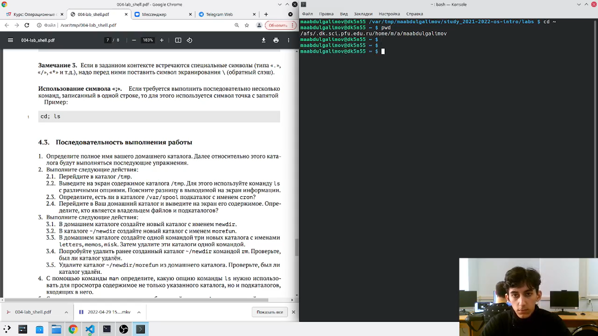
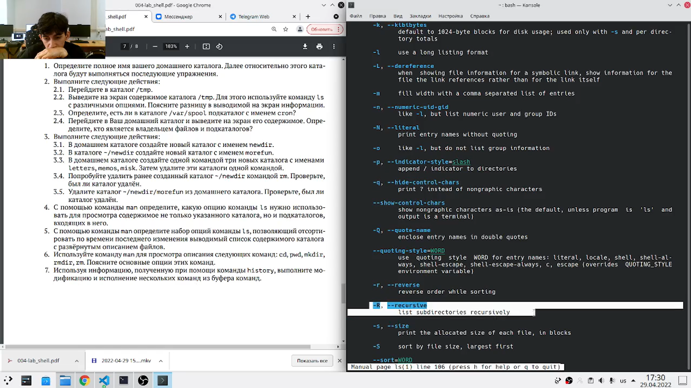
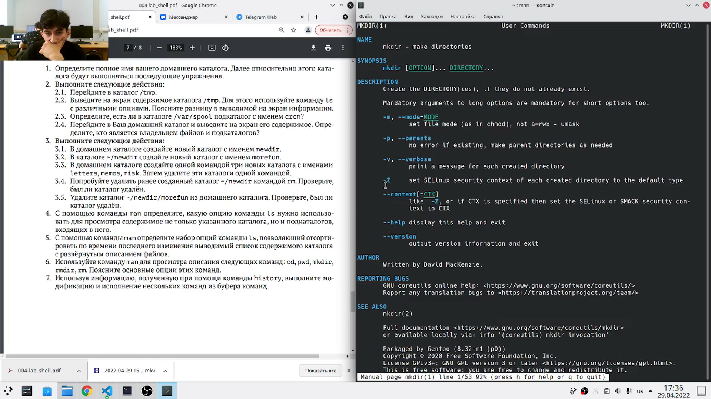
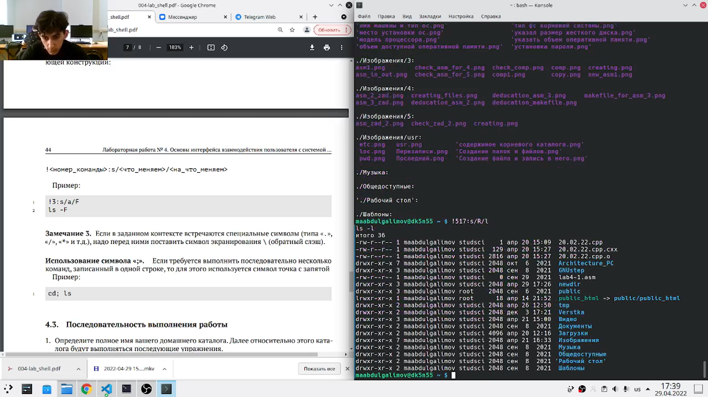

---
## Front matter
lang: ru-RU
title: Презентация по лабораторной работе № 4
author: Абдулгалимов Мурад
	Leonid A. Sevastianov\inst{1,3}
	\and
	Anton L. Sevastianov\inst{1}
	\and
	Edik A. Ayrjan\inst{2}
	\and
	Anna V. Korolkova\inst{1}
	\and
	Dmitry S. Kulyabov\inst{1,2}
	\and
	Imrikh Pokorny\inst{4}
institute: Российский Университет Дружбы Народов
	\inst{1}RUDN University, Moscow, Russian Federation
	\and
	\inst{2}LIT JINR, Dubna, Russian Federation
	\and
	\inst{3}BLTP JINR, Dubna, Russian Federation
	\and
	\inst{4}Technical University of Košice, Košice, Slovakia
date: NEC--2019, 30 September -- 4 October, 2019 Budva, Montenegro

## Formatting
toc: false
slide_level: 2
theme: metropolis
header-includes: 
 - \metroset{progressbar=frametitle,sectionpage=progressbar,numbering=fraction}
 - '\makeatletter'
 - '\beamer@ignorenonframefalse'
 - '\makeatother'
aspectratio: 43
section-titles: true
---

# Цель работы

Приобретение практических навыков взаимодействия пользователя с системой посредством командной строки.

# Задание

Выполнить список команд в командной строки Linux.

---

## Определил полное имя домашнего каталога. (рис. [-@fig:001])
Команда: 
```
pwd
```

{ #fig:001 width=70% }

---

## Перешел в каталог /tmp и вывел на экран содержимое каталога /tmp. (рис. [-@fig:002])
Команды:
```
cd /tmp
ls
ls -l
ls -F
ls -a
```

{ #fig:002 width=50% }

---

## Определил, есть ли в каталоге /var/spool подкаталог с именем cron? Перешел в домашний каталог и вывел на экран его содержимое. Также определил, кто является владельцем файлов и подкаталогов. (рис. [-@fig:003])
Команды:
```
cd /var/spool
ls
ls -l
```

{ #fig:003 width=40% }

---

## В домашнем каталоге создал новый каталог с именем newdir. В каталоге ~/newdir создал новый каталог с именем morefun. В домашнем каталоге создал одной командой три новых каталога с именами letters, memos, misk. Затем удалил эти каталоги одной командой. (рис. [-@fig:005])
Команды:
```
mkdir ~/newdir
cd newdir
mkdir morefun
mkdir ~/{letters,memos,misk}
cd ~
rmdir letters memos misk
```

{ #fig:005 width=30% }

---

## Попробовал удалить ранее созданный каталог ~/newdir командой rm. Проверил, был ли каталог удалён. Удалил каталог ~/newdir/morefun из домашнего каталога. Проверил, был ли каталог удалён. (рис. [-@fig:006])
Команды:
```
rm ~/newdir
rm ~/newdir/morefun
```

{ #fig:006 width=50% }

---

## С помощью команды man определил, какую опцию команды ls нужно использовать для просмотра содержимого не только указанного каталога, но и подкаталогов, входящих в него. (рис. [-@fig:007])
Команды:
```
ls -R
```

{ #fig:007 width=60% }

---

## С помощью команды man определил набор опций команды ls, позволяющий отсортировать по времени последнего изменения выводимый список содержимого каталога с развёрнутым описанием файлов. (рис. [-@fig:008])
Команды:
```
ls --sort=time -l
```

{ #fig:008 width=50% }

---

## Использовал команду man для просмотра описания следующих команд: cd, pwd, mkdir, rmdir, rm. (рис. [-@fig:009])
Команды:
```
man cd
man pwd
man mkdir
man rmdir
man rm
```

{ #fig:009 width=50% }

---

## Используя информацию, полученную при помощи команды history, выполнил модификацию и исполнение нескольких команд из буфера команд. (рис. [-@fig:010])
Команды:
```
history
!522
!517:s/R/l
```

{ #fig:010 width=50% }

---

# Выводы

Приобрел практические навыкы взаимодействия с системой посредством командной строки.