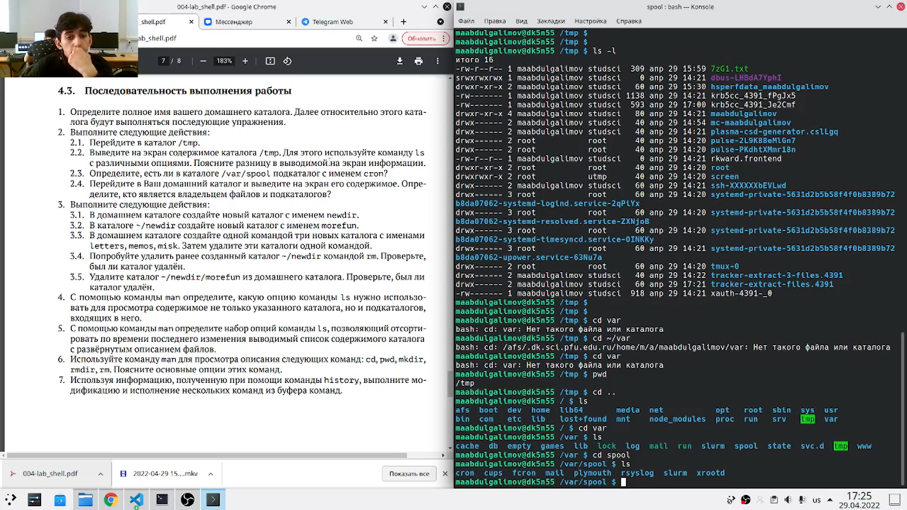
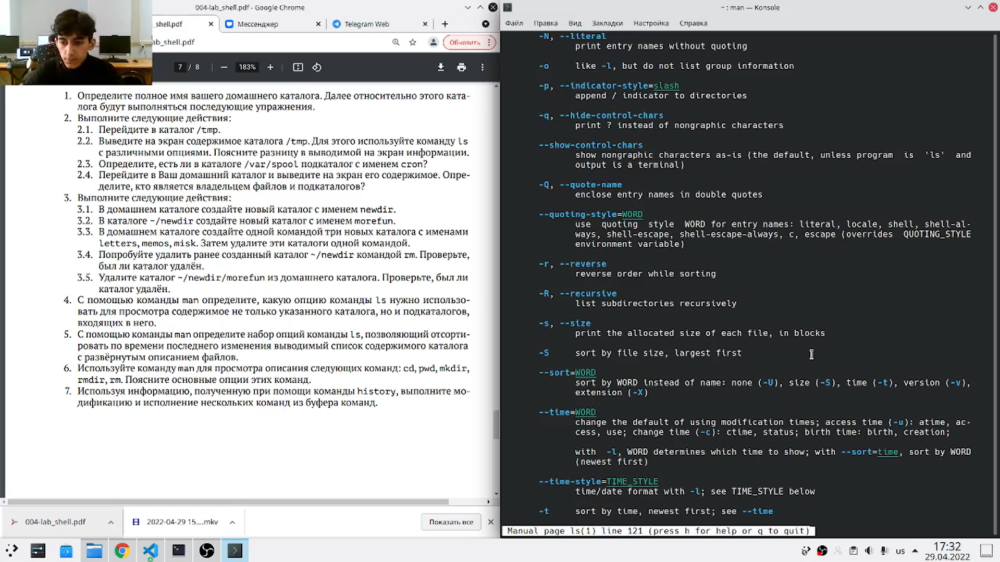

---
## Front matter
title: "Отччет по лабораторной работе № 4"
subtitle: "Российский университет дружбы народов"
author: "Абдулгалимов Мурад"

## Generic otions
lang: ru-RU
toc-title: "Содержание"

## Bibliography
bibliography: bib/cite.bib
csl: pandoc/csl/gost-r-7-0-5-2008-numeric.csl

## Pdf output format
toc: true # Table of contents
toc-depth: 2
lof: true # List of figures
lot: true # List of tables
fontsize: 12pt
linestretch: 1.5
papersize: a4
documentclass: scrreprt
## I18n polyglossia
polyglossia-lang:
  name: russian
  options:
	- spelling=modern
	- babelshorthands=true
polyglossia-otherlangs:
  name: english
## I18n babel
babel-lang: russian
babel-otherlangs: english
## Fonts
mainfont: PT Serif
romanfont: PT Serif
sansfont: PT Sans
monofont: PT Mono
mainfontoptions: Ligatures=TeX
romanfontoptions: Ligatures=TeX
sansfontoptions: Ligatures=TeX,Scale=MatchLowercase
monofontoptions: Scale=MatchLowercase,Scale=0.9
## Biblatex
biblatex: true
biblio-style: "gost-numeric"
biblatexoptions:
  - parentracker=true
  - backend=biber
  - hyperref=auto
  - language=auto
  - autolang=other*
  - citestyle=gost-numeric
## Pandoc-crossref LaTeX customization
figureTitle: "Рис."
tableTitle: "Таблица"
listingTitle: "Листинг"
lofTitle: "Список иллюстраций"
lotTitle: "Список таблиц"
lolTitle: "Листинги"
## Misc options
indent: true
header-includes:
  - \usepackage{indentfirst}
  - \usepackage{float} # keep figures where there are in the text
  - \floatplacement{figure}{H} # keep figures where there are in the text
---

# Цель работы

Приобретение практических навыков взаимодействия пользователя с системой посредством командной строки.

# Задание

Выполнить список команд в командной строки Linux.

# Выполнение лабораторной работы

## Определил полное имя домашнего каталога. (рис. [-@fig:001])
Команда: 
```
pwd
```

{ #fig:001 width=70% }

## Перешел в каталог /tmp и вывел на экран содержимое каталога /tmp. (рис. [-@fig:002])
Команды:
```
cd /tmp
ls
ls -l
ls -F
ls -a
```

{ #fig:002 width=70% }

## Определил, есть ли в каталоге /var/spool подкаталог с именем cron? Перешел в домашний каталог и вывел на экран его содержимое. Также определил, кто является владельцем файлов и подкаталогов. (рис. [-@fig:003], [-@fig:004])
Команды:
```
cd /var/spool
ls
ls -l
```

{ #fig:003 width=70% }

{ #fig:004 width=70% }

## В домашнем каталоге создал новый каталог с именем newdir. В каталоге ~/newdir создал новый каталог с именем morefun. В домашнем каталоге создал одной командой три новых каталога с именами letters, memos, misk. Затем удалил эти каталоги одной командой. (рис. [-@fig:005])
Команды:
```
mkdir ~/newdir
cd newdir
mkdir morefun
mkdir ~/{letters,memos,misk}
cd ~
rmdir letters memos misk
```

{ #fig:005 width=70% }

## Попробовал удалить ранее созданный каталог ~/newdir командой rm. Проверил, был ли каталог удалён. Удалил каталог ~/newdir/morefun из домашнего каталога. Проверил, был ли каталог удалён. (рис. [-@fig:006])
Команды:
```
rm ~/newdir
rm ~/newdir/morefun
```

{ #fig:006 width=70% }

## С помощью команды man определил, какую опцию команды ls нужно использовать для просмотра содержимого не только указанного каталога, но и подкаталогов, входящих в него. (рис. [-@fig:007])
Команды:
```
ls -R
```

{ #fig:007 width=70% }

## С помощью команды man определил набор опций команды ls, позволяющий отсортировать по времени последнего изменения выводимый список содержимого каталога с развёрнутым описанием файлов. (рис. [-@fig:008])
Команды:
```
ls --sort=time -l
```

{ #fig:008 width=70% }

## Использовал команду man для просмотра описания следующих команд: cd, pwd, mkdir, rmdir, rm. (рис. [-@fig:009])
Команды:
```
man cd
man pwd
man mkdir
man rmdir
man rm
```

{ #fig:009 width=70% }

## Используя информацию, полученную при помощи команды history, выполнил модификацию и исполнение нескольких команд из буфера команд. (рис. [-@fig:010])
Команды:
```
history
!522
!517:s/R/l
```

{ #fig:010 width=70% }


# Выводы

Приобрел практические навыкы взаимодействия с системой посредством командной строки.

# Список литературы{.unnumbered}

::: {#refs}
:::
