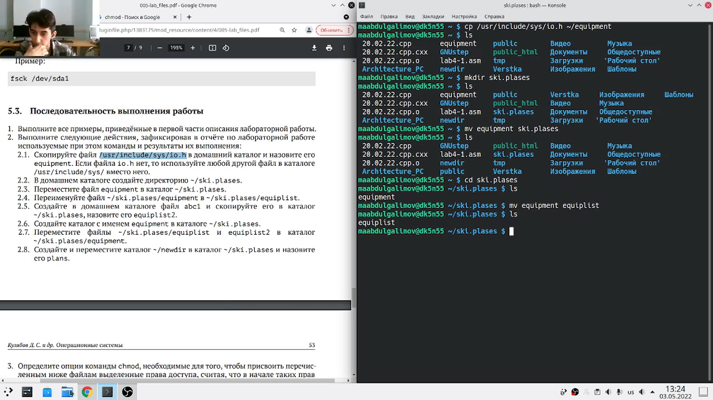
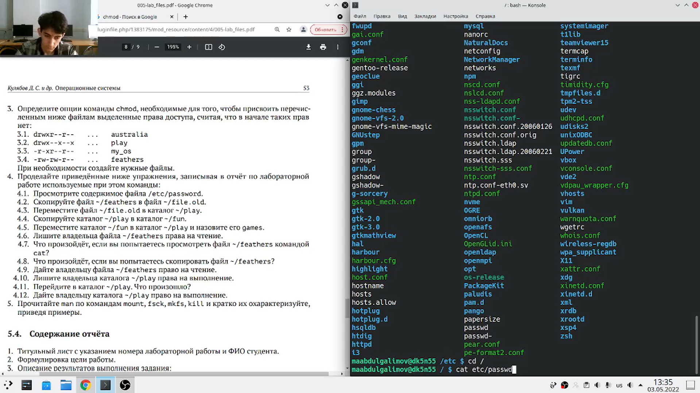
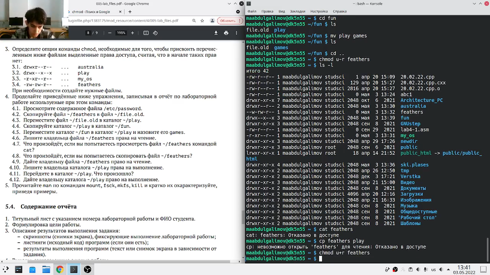

---
## Front matter
lang: ru-RU
title: Презентация к лабораторной работе № 5
author: |
	Leonid A. Sevastianov\inst{1,3}
	\and
	Anton L. Sevastianov\inst{1}
	\and
	Edik A. Ayrjan\inst{2}
	\and
	Anna V. Korolkova\inst{1}
	\and
	Dmitry S. Kulyabov\inst{1,2}
	\and
	Imrikh Pokorny\inst{4}
institute: |
	\inst{1}RUDN University, Moscow, Russian Federation
	\and
	\inst{2}LIT JINR, Dubna, Russian Federation
	\and
	\inst{3}BLTP JINR, Dubna, Russian Federation
	\and
	\inst{4}Technical University of Košice, Košice, Slovakia
date: NEC--2019, 30 September -- 4 October, 2019 Budva, Montenegro

## Formatting
toc: false
slide_level: 2
theme: metropolis
header-includes: 
 - \metroset{progressbar=frametitle,sectionpage=progressbar,numbering=fraction}
 - '\makeatletter'
 - '\beamer@ignorenonframefalse'
 - '\makeatother'
aspectratio: 43
section-titles: true
---

# Цель работы

Ознакомление с файловой системой Linux, её структурой, именами и содержанием
каталогов. Приобретение практических навыков по применению команд для работы
с файлами и каталогами, по управлению процессами (и работами), по проверке использования диска и обслуживанию файловой системы.

# Задание

1. Выполните все примеры, приведённые в первой части описания лабораторной работы.
2. Выполните следующие действия, зафиксировав в отчёте по лабораторной работе
используемые при этом команды и результаты их выполнения:
2.1. Скопируйте файл /usr/include/sys/io.h в домашний каталог и назовите его
equipment. Если файла io.h нет, то используйте любой другой файл в каталоге
/usr/include/sys/ вместо него.
2.2. В домашнем каталоге создайте директорию ~/ski.plases.
2.3. Переместите файл equipment в каталог ~/ski.plases.
2.4. Переименуйте файл ~/ski.plases/equipment в ~/ski.plases/equiplist.
2.5. Создайте в домашнем каталоге файл abc1 и скопируйте его в каталог
~/ski.plases, назовите его equiplist2.
2.6. Создайте каталог с именем equipment в каталоге ~/ski.plases.
2.7. Переместите файлы ~/ski.plases/equiplist и equiplist2 в каталог
~/ski.plases/equipment.
2.8. Создайте и переместите каталог ~/newdir в каталог ~/ski.plases и назовите
его plans.
Кулябов Д. С. и др. Операционные системы 53
3. Определите опции команды chmod, необходимые для того, чтобы присвоить перечисленным ниже файлам выделенные права доступа, считая, что в начале таких прав
нет:
3.1. drwxr--r-- ... australia
3.2. drwx--x--x ... play
3.3. -r-xr--r-- ... my_os
3.4. -rw-rw-r-- ... feathers
При необходимости создайте нужные файлы.
4. Проделайте приведённые ниже упражнения, записывая в отчёт по лабораторной
работе используемые при этом команды:
4.1. Просмотрите содержимое файла /etc/password.
4.2. Скопируйте файл ~/feathers в файл ~/file.old.
4.3. Переместите файл ~/file.old в каталог ~/play.
4.4. Скопируйте каталог ~/play в каталог ~/fun.
4.5. Переместите каталог ~/fun в каталог ~/play и назовите его games.
4.6. Лишите владельца файла ~/feathers права на чтение.
4.7. Что произойдёт, если вы попытаетесь просмотреть файл ~/feathers командой
cat?
4.8. Что произойдёт, если вы попытаетесь скопировать файл ~/feathers?
4.9. Дайте владельцу файла ~/feathers право на чтение.
4.10. Лишите владельца каталога ~/play права на выполнение.
4.11. Перейдите в каталог ~/play. Что произошло?
4.12. Дайте владельцу каталога ~/play право на выполнение.
5. Прочитайте man по командам mount, fsck, mkfs, kill и кратко их охарактеризуйте,
приведя примеры.

# Выполнение лабораторной работы

### Скопировал файл /usr/include/sys/io.h в домашний каталог и назвал его equipment. В домашнем каталоге создал директорию ~/ski.plases. Переместил файл equipment в каталог ~/ski.plases. Переименовал файл ~/ski.plases/equipment в ~/ski.plases/equiplist (рис. [-@fig:001])
Команды:
```
cp /usr/include/sys/io.h ~/equipment
mkdir ski.plases
mv equpment ~/ski.plases
cd ski.plases
mv eqipment equiplist
```

{ #fig:001 width=30% }

---

### Создал в домашнем каталоге файл abc1 и скопировал его в каталог ~/ski.plases, назвал его equiplist2. Создал каталог с именем equipment в каталоге ~/ski.plases. Переместил файлы ~/ski.plases/equiplist и equiplist2 в каталог ~/ski.plases/equipment. Создал и переместил каталог ~/newdir в каталог ~/ski.plases и назвал его plans. (рис. [-@fig:002])

Команды:
```
touch abc1
cp abc1 ski.plases
mv abc1 equiplist2
mkdir equipment
mv equiplist equiplist2 equipment
cd ~
mkdir newdir
```

{ #fig:002 width=30% }

---

### Определил опции команды chmod, необходимые для того, чтобы присвоить перечисленным ниже файлам выделенные права доступа, считая, что в начале таких прав нет (рис. [-@fig:003]):
3.1. drwxr--r-- ... australia

3.2. drwx--x--x ... play

3.3. -r-xr--r-- ... my_os

3.4. -rw-rw-r-- ... feathers

Команды:
```
mkdir australia
chmod 744 australia
mkdir play
chmod 711 play
touch my_os
chmod 544 my_os
touch feathers
chmod 664 feathers
```
{ #fig:003 width=25% }

---

### Просмотрел содержимое файла /etc/password (рис. [-@fig:004])

Команды:
```
cat etc/passwd
```

{ #fig:004 width=30% }

---

### Скопируйте файл ~/feathers в файл ~/file.old. Переместите файл ~/file.old в каталог ~/play. Скопируйте каталог ~/play в каталог ~/fun. Переместите каталог ~/fun в каталог ~/play и назовите его games (рис. [-@fig:005])
Команды:
```
cp ~/feathers ~/file.old
mv ~/file.old ~/play
cp ~/play -r ~/fun
mv ~/fun -r ~/play
mv ~/fun games
```

{ #fig:005 width=30% }

---

### Лишил владельца файла ~/feathers права на чтение. (рис. [-@fig:006])
Команды:
```
chmod u-r feathers
cat feathers
cat: feathers: Отказано в доступе
```

{ #fig:006 width=30% }

---

### Узнал что произойдёт, если вы попытаться скопировать файл ~/feathers? Дал владельцу файла ~/feathers право на чтение. (рис. [-@fig:007])
Команды:
```
cp ~/feathers
cp: невозможно открыть 'feathers' для чтения: Откзано в доступе
chmod u+r feathers
```

{ #fig:007 width=30% }

---

### Лишил владельца каталога ~/play права на выполнение (рис. [-@fig:008])
Команды:
```
chmod u-x ~/play
```

{ #fig:008 width=50% }

---

### Перешел в каталог ~/play. Дал владельцу каталога ~/play право на выполнение. (рис. [-@fig:009])
Команды:
```
cd ~/play
cd: невозможно открыть '~/play' для выполнения: Откзано в доступе
```

{ #fig:009 width=30% }

---

### Прочитал man по командам mount, fsck, mkfs, kill и кратко их охарактеризовал, приведя примеры. (рис. [-@fig:010])

{ #fig:010 width=50% }

# Выводы

Приобрел практические навыки по применению команд для работы с файлами и каталогами, по управлению процессами (и работами), по проверке использования диска и обслуживанию файловой системы.