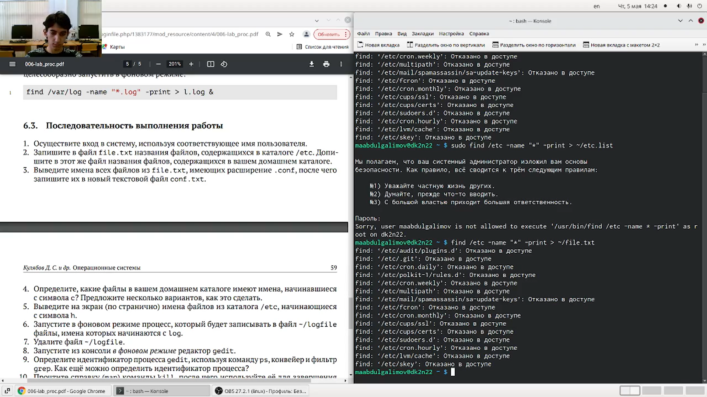
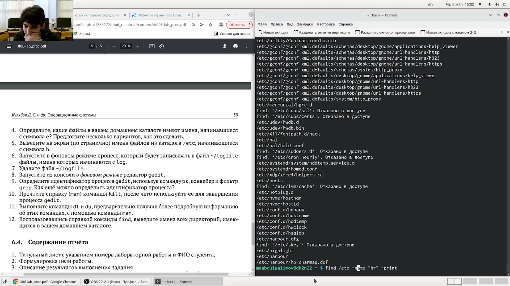
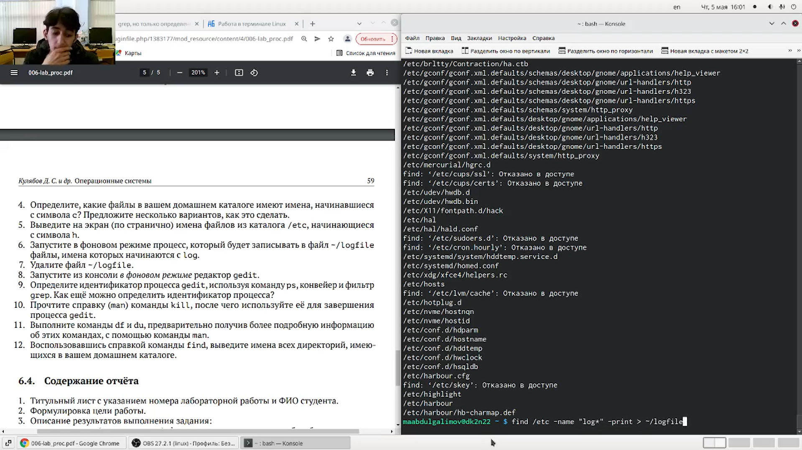
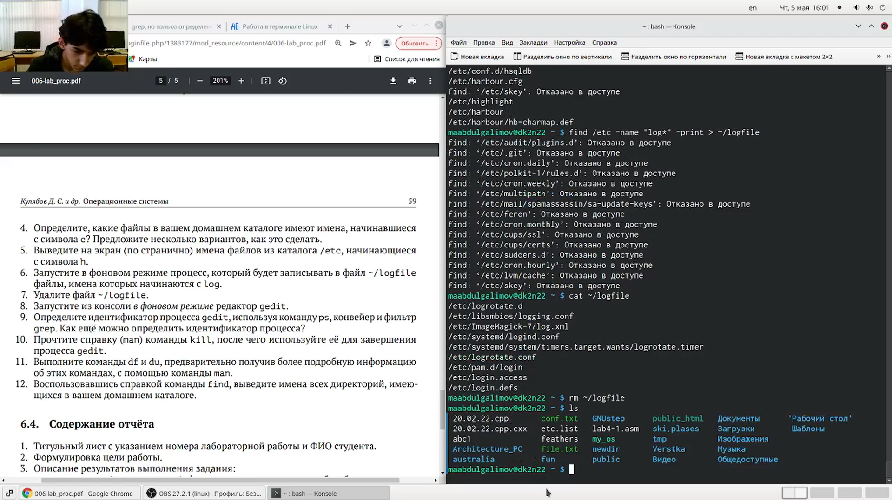
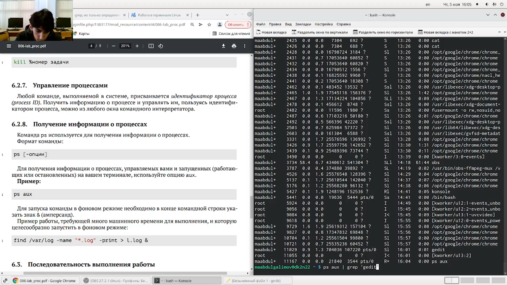
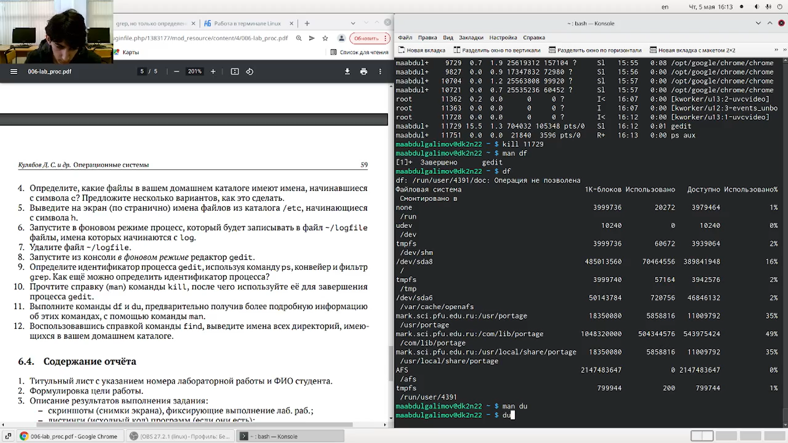

---
## Front matter
lang: ru-RU
title: Презентация по лабораторной работе № 6
author: |
	Leonid A. Sevastianov\inst{1,3}
	\and
	Anton L. Sevastianov\inst{1}
	\and
	Edik A. Ayrjan\inst{2}
	\and
	Anna V. Korolkova\inst{1}
	\and
	Dmitry S. Kulyabov\inst{1,2}
	\and
	Imrikh Pokorny\inst{4}
institute: |
	\inst{1}RUDN University, Moscow, Russian Federation
	\and
	\inst{2}LIT JINR, Dubna, Russian Federation
	\and
	\inst{3}BLTP JINR, Dubna, Russian Federation
	\and
	\inst{4}Technical University of Košice, Košice, Slovakia
date: NEC--2019, 30 September -- 4 October, 2019 Budva, Montenegro

## Formatting
toc: false
slide_level: 2
theme: metropolis
header-includes: 
 - \metroset{progressbar=frametitle,sectionpage=progressbar,numbering=fraction}
 - '\makeatletter'
 - '\beamer@ignorenonframefalse'
 - '\makeatother'
aspectratio: 43
section-titles: true
---

# Цель работы

Ознакомление с инструментами поиска файлов и фильтрации текстовых данных.
Приобретение практических навыков: по управлению процессами (и заданиями), по
проверке использования диска и обслуживанию файловых систем.

---

# Выполнение лабораторной работы

### Записал в файл file.txt названия файлов, содержащихся в каталоге /etc. Дописал в этот же файл названия файлов, содержащихся в домашнем каталоге. (рис. [-@fig:001])
Команды:
```
find /etc -name "*" -print > ~/file.txt
find ~ -name "*" -print >> ~/file.txt
```

{ #fig:001 width=30% }

---

### Вывел имена всех файлов из file.txt, имеющих расширение .conf, после чего запишисал их в новый текстовой файл conf.txt. (рис. [-@fig:002])
Команды:
```
grep '\.conf' file.txt > ~/conf.txt
```

{ #fig:002 width=30% }

---

### Определил, какие файлы в вашем домашнем каталоге имеют имена, начинавшиеся с символа c. (рис. [-@fig:003])
Команды:
```
find ~ -name "c*" -print
ls -R | grep ^c
```

{ #fig:003 width=30% }

---

### Вывел на экран (по странично) имена файлов из каталога /etc, начинающиеся с символа h. (рис. [-@fig:005])
Команды:
```
find /etc -name "h*" -print
```

{ #fig:005 width=30% }

---

### Запустил в фоновом режиме процесс, который будет записывать в файл ~/logfile файлы, имена которых начинаются с log. (рис. [-@fig:006])
Команды:
```
find /etc -name "log*" -print > ~/logfile &
```

{ #fig:006 width=30% }

---

### Удалил файл ~/logfile. (рис. [-@fig:007])
Команды:
```
rm ~/logfile
```

{ #fig:007 width=30% }

---

### Запустите из консоли в фоновом режиме редактор gedit (рис. [-@fig:008])
Команды:
```
gedit &
```

{ #fig:008 width=30% }

---

### Определил идентификатор процесса gedit, используя команду ps, конвейер и фильтр grep. (рис. [-@fig:009])
Команды:
```
ps aux | grep 'gedit'
```

{ #fig:009 width=30% }

---

### Прочитал справку (man) команды kill, после чего использовал её для завершения процесса gedit. (рис. [-@fig:010])
Команды:
```
kill 11729
```

{ #fig:010 width=30% }

---

### Выполнил команды df и du, предварительно получив более подробную информацию об этих командах, с помощью команды man. (рис. [-@fig:011])
Команды:
```
man df
df
man du
du
```

{ #fig:011 width=30% }

---

### Воспользовавшись справкой команды find, вывел имена всех директорий, имеющихся в вашем домашнем каталоге. (рис. [-@fig:012])
Команды:
```
find . -maxdepth 1  
```

{ #fig:012 width=30% }

---

# Выводы

Ознакомился с инструментами поиска файлов и фильтрации текстовых данных.
Приобрел практические навыки: по управлению процессами (и заданиями), по
проверке использования диска и обслуживанию файловых систем.