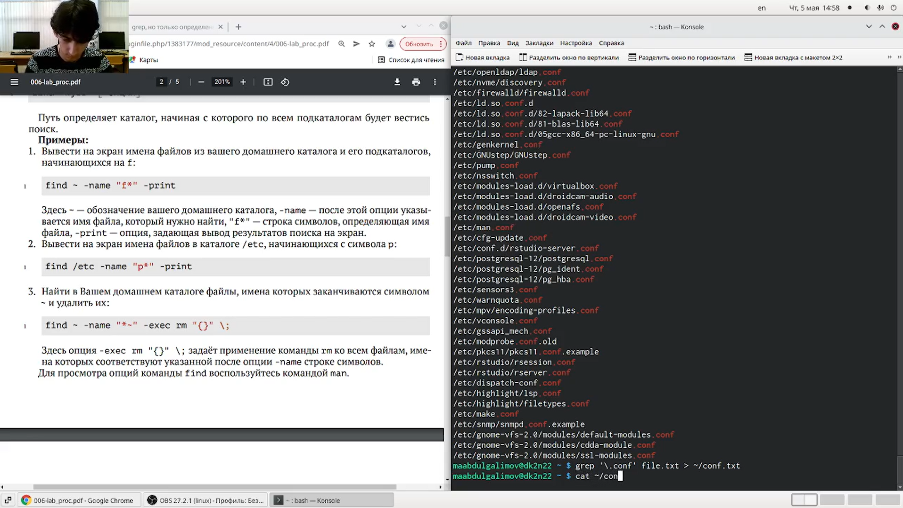
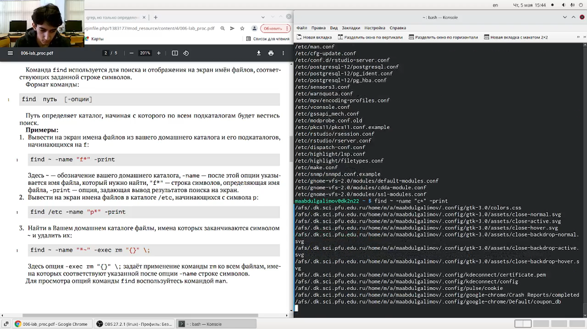
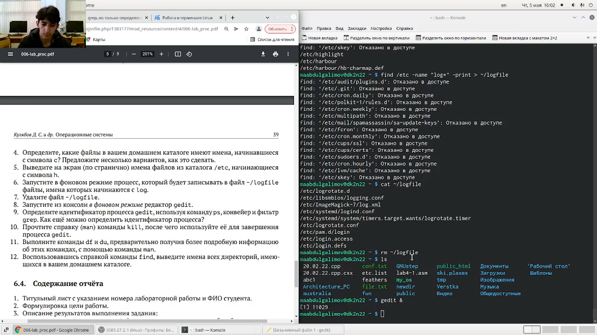
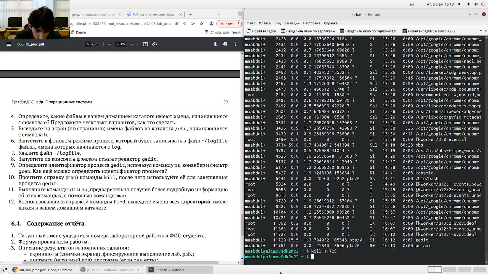
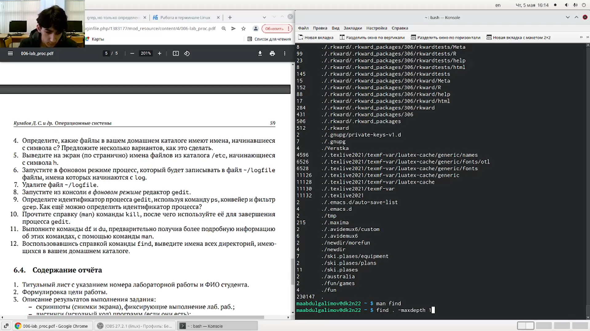

---
## Front matter
title: "Отчет по лабораторной работе № 6"
subtitle: "Российский Университет Дружбы Народов"
author: "Абдулгалимов Мурад Арсенович"

## Generic otions
lang: ru-RU
toc-title: "Содержание"

## Bibliography
bibliography: bib/cite.bib
csl: pandoc/csl/gost-r-7-0-5-2008-numeric.csl

## Pdf output format
toc: true # Table of contents
toc-depth: 2
lof: true # List of figures
lot: true # List of tables
fontsize: 12pt
linestretch: 1.5
papersize: a4
documentclass: scrreprt
## I18n polyglossia
polyglossia-lang:
  name: russian
  options:
	- spelling=modern
	- babelshorthands=true
polyglossia-otherlangs:
  name: english
## I18n babel
babel-lang: russian
babel-otherlangs: english
## Fonts
mainfont: PT Serif
romanfont: PT Serif
sansfont: PT Sans
monofont: PT Mono
mainfontoptions: Ligatures=TeX
romanfontoptions: Ligatures=TeX
sansfontoptions: Ligatures=TeX,Scale=MatchLowercase
monofontoptions: Scale=MatchLowercase,Scale=0.9
## Biblatex
biblatex: true
biblio-style: "gost-numeric"
biblatexoptions:
  - parentracker=true
  - backend=biber
  - hyperref=auto
  - language=auto
  - autolang=other*
  - citestyle=gost-numeric
## Pandoc-crossref LaTeX customization
figureTitle: "Рис."
tableTitle: "Таблица"
listingTitle: "Листинг"
lofTitle: "Список иллюстраций"
lotTitle: "Список таблиц"
lolTitle: "Листинги"
## Misc options
indent: true
header-includes:
  - \usepackage{indentfirst}
  - \usepackage{float} # keep figures where there are in the text
  - \floatplacement{figure}{H} # keep figures where there are in the text
---

# Цель работы

Ознакомление с инструментами поиска файлов и фильтрации текстовых данных.
Приобретение практических навыков: по управлению процессами (и заданиями), по
проверке использования диска и обслуживанию файловых систем.

# Задание

1. Осуществите вход в систему, используя соответствующее имя пользователя.
2. Запишите в файл file.txt названия файлов, содержащихся в каталоге /etc. Допишите в этот же файл названия файлов, содержащихся в вашем домашнем каталоге.
3. Выведите имена всех файлов из file.txt, имеющих расширение .conf, после чего
запишите их в новый текстовой файл conf.txt.
4. Определите, какие файлы в вашем домашнем каталоге имеют имена, начинавшиеся
с символа c? Предложите несколько вариантов, как это сделать.
5. Выведите на экран (по странично) имена файлов из каталога /etc, начинающиеся
с символа h.
6. Запустите в фоновом режиме процесс, который будет записывать в файл ~/logfile
файлы, имена которых начинаются с log.
7. Удалите файл ~/logfile.
8. Запустите из консоли в фоновом режиме редактор gedit.
9. Определите идентификатор процесса gedit, используя команду ps, конвейер и фильтр
grep. Как ещё можно определить идентификатор процесса?
10. Прочтите справку (man) команды kill, после чего используйте её для завершения
процесса gedit.
11. Выполните команды df и du, предварительно получив более подробную информацию
об этих командах, с помощью команды man.
12. Воспользовавшись справкой команды find, выведите имена всех директорий, имеющихся в вашем домашнем каталоге.

# Выполнение лабораторной работы

### Записал в файл file.txt названия файлов, содержащихся в каталоге /etc. Дописал в этот же файл названия файлов, содержащихся в домашнем каталоге. (рис. [-@fig:001])
Команды:
```
find /etc -name "*" -print > ~/file.txt
find ~ -name "*" -print >> ~/file.txt
```

{ #fig:001 width=70% }

### Вывел имена всех файлов из file.txt, имеющих расширение .conf, после чего запишисал их в новый текстовой файл conf.txt. (рис. [-@fig:002])
Команды:
```
grep '\.conf' file.txt > ~/conf.txt
```

{ #fig:002 width=70% }

### Определил, какие файлы в вашем домашнем каталоге имеют имена, начинавшиеся с символа c. (рис. [-@fig:003], [-@fig:004])
Команды:
```
find ~ -name "c*" -print
ls -R | grep ^c
```

{ #fig:003 width=70% }

{ #fig:004 width=70% }

### Вывел на экран (по странично) имена файлов из каталога /etc, начинающиеся с символа h. (рис. [-@fig:005])
Команды:
```
find /etc -name "h*" -print
```

{ #fig:005 width=70% }

### Запустил в фоновом режиме процесс, который будет записывать в файл ~/logfile файлы, имена которых начинаются с log. (рис. [-@fig:006])
Команды:
```
find /etc -name "log*" -print > ~/logfile &
```

{ #fig:006 width=70% }

### Удалил файл ~/logfile. (рис. [-@fig:007])
Команды:
```
rm ~/logfile
```

{ #fig:007 width=70% }

### Запустите из консоли в фоновом режиме редактор gedit (рис. [-@fig:008])
Команды:
```
gedit &
```

{ #fig:008 width=70% }

### Определил идентификатор процесса gedit, используя команду ps, конвейер и фильтр grep. (рис. [-@fig:009])
Команды:
```
ps aux | grep 'gedit'
```

{ #fig:009 width=70% }

### Прочитал справку (man) команды kill, после чего использовал её для завершения процесса gedit. (рис. [-@fig:010])
Команды:
```
kill 11729
```

{ #fig:010 width=70% }

### Выполнил команды df и du, предварительно получив более подробную информацию об этих командах, с помощью команды man. (рис. [-@fig:011])
Команды:
```
man df
df
man du
du
```

{ #fig:011 width=70% }

### Воспользовавшись справкой команды find, вывел имена всех директорий, имеющихся в вашем домашнем каталоге. (рис. [-@fig:012])
Команды:
```
find . -maxdepth 1  
```

{ #fig:012 width=70% }

# Выводы

Ознакомился с инструментами поиска файлов и фильтрации текстовых данных.
Приобрел практические навыки: по управлению процессами (и заданиями), по
проверке использования диска и обслуживанию файловых систем.

# Контрольные вопросы
1.	Какие потоки ввода вывода вы знаете?
•	В системе по умолчанию открыто три специальных потока:
–	stdin — стандартный поток ввода (по умолчанию: клавиатура), файловый дескриптор 0;
–	stdout — стандартный поток вывода (по умолчанию: консоль), файловый дескриптор 1;
–	stderr — стандартный поток вывод сообщений об ошибках (по умолчанию: консоль), файловый дескриптор 2.
2.	Объясните разницу между операцией > и >>.
•	“>” - перенаправление вывода (stdout) в файл.
•	“>>” - Перенаправление вывода (stdout) в файл, но при этом он открывается в режиме добавления.
3.	Что такое конвейер?
•	Конвейер (pipe) служит для объединения простых команд или утилит в цепочки, в которых результат работы предыдущей команды передаётся последующей.
4.	Что такое процесс? Чем это понятие отличается от программы?
•	Главное отличие между программой и процессом заключается в том, что программа - это набор инструкций, который позволяет ЦПУ выполнять определенную задачу, в то время как процесс - это исполняемая программа.

5.	Что такое PID и GID?
•	Каждому процессу Linux или Unix или выполняемой программе, автоматически присваивается идентификационный номер уникального процесса (PID). PID автоматически присваивает номер для каждого процесса в системе.
•	Кроме идентификационного номера пользователя с учётной записью связан идентификатор группы. Группы пользователей применяются для организации доступа нескольких пользователей к некоторым ресурсам. У группы, так же, как и у пользователя, есть имя и идентификационный номер — GID
7.	Что такое задачи и какая команда позволяет ими управлять?
•	Запущенные фоном программы называются задачами (jobs). Ими можно управлять с помощью команды jobs, которая выводит список запущенных в данный момент задач. Для завершения задачи необходимо выполнить команду kill.
8.	Найдите информацию об утилитах top и htop. Каковы их функции?
•	top - интерактивный просмотрщик процессов. htop аналог top.
9.	Назовите и дайте характеристику команде поиска файлов.
•	Команда find используется для поиска и отображения на экран имён файлов, соответствующих заданной строке символов.
10.	Можно ли по контексту (содержанию) найти файл? Если да, то как?
•	grep -r -n «text» /path , где -n показывает строку, где был найден фрагмент, а -r осуществляет розыск рекурсивно, в файлах в самом каталоге /path и в его подкаталогах;
11.	Как определить объем свободной памяти на жёстком диске?
•	С помощью команды df -h можно посмотреть объем занятой и свободной памяти на жестком диске.
12.	Как определить объем вашего домашнего каталога?
•	Воспользоваться командой, указанной выше, и постараться найти домашний каталог среди всех остальных.
13.	Как удалить зависший процесс?
•	Узнать его идентификационный номер и воспользоваться командой kill.

# Список литературы{.unnumbered}

::: {#refs}
:::
