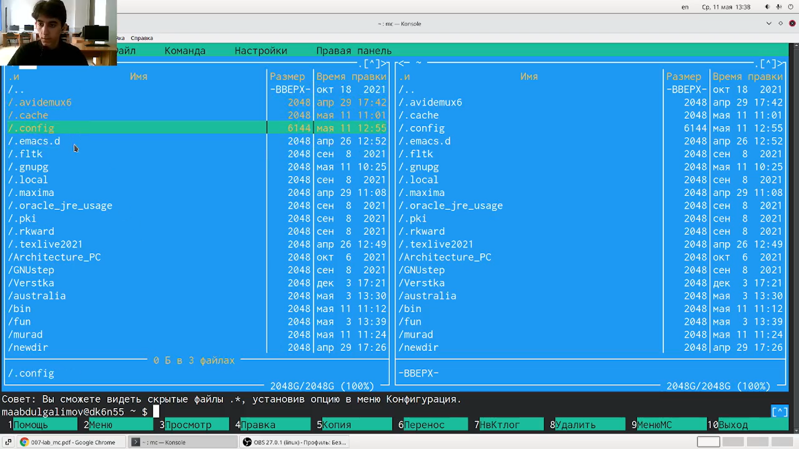
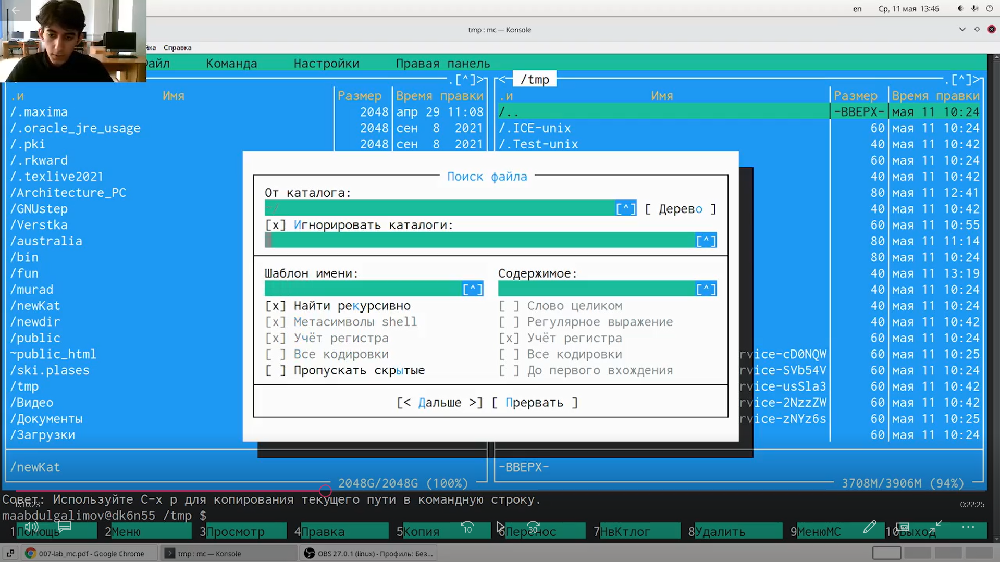
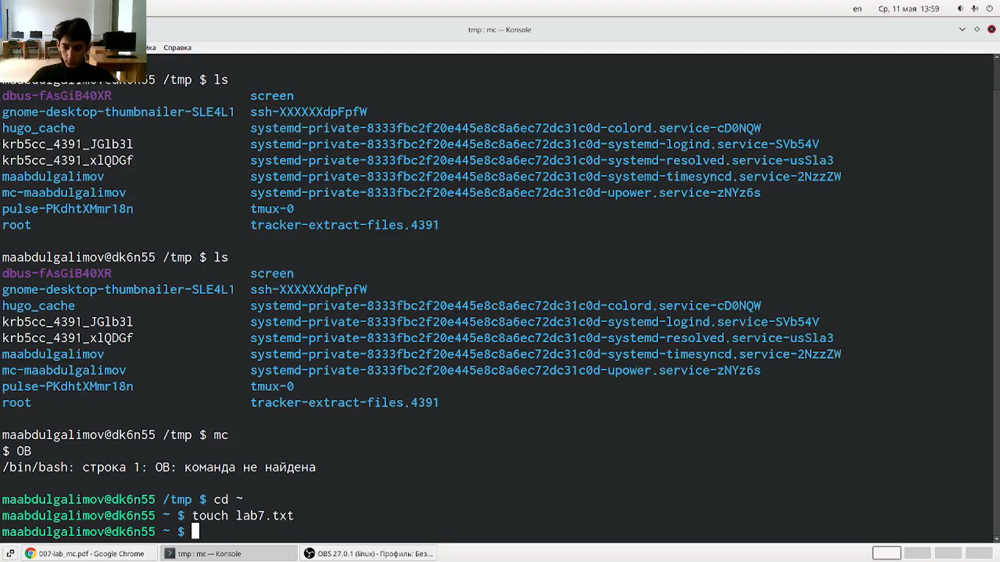
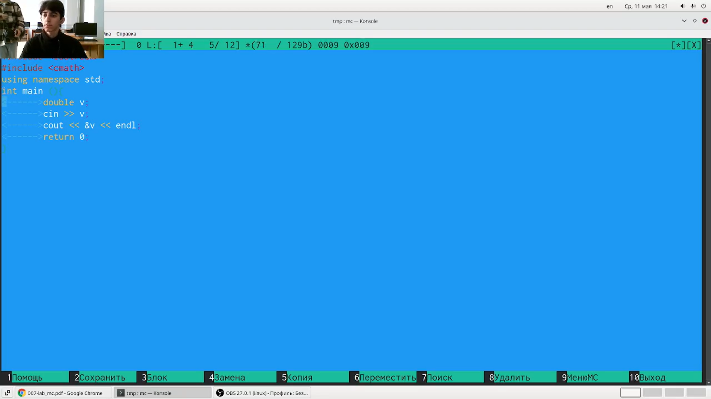

---
## Front matter
lang: ru-RU
title: Презентация по лабораторной работе № 7
author: |
	Leonid A. Sevastianov\inst{1,3}
	\and
	Anton L. Sevastianov\inst{1}
	\and
	Edik A. Ayrjan\inst{2}
	\and
	Anna V. Korolkova\inst{1}
	\and
	Dmitry S. Kulyabov\inst{1,2}
	\and
	Imrikh Pokorny\inst{4}
institute: |
	\inst{1}RUDN University, Moscow, Russian Federation
	\and
	\inst{2}LIT JINR, Dubna, Russian Federation
	\and
	\inst{3}BLTP JINR, Dubna, Russian Federation
	\and
	\inst{4}Technical University of Košice, Košice, Slovakia
date: NEC--2019, 30 September -- 4 October, 2019 Budva, Montenegro

## Formatting
toc: false
slide_level: 2
theme: metropolis
header-includes: 
 - \metroset{progressbar=frametitle,sectionpage=progressbar,numbering=fraction}
 - '\makeatletter'
 - '\beamer@ignorenonframefalse'
 - '\makeatother'
aspectratio: 43
section-titles: true
---

# Цель работы

Освоение основных возможностей командной оболочки Midnight Commander. Приобретение навыков практической работы по просмотру каталогов и файлов; манипуляций
с ними.

# Выполнение лабораторной работы

### Выполнил несколько операций в mc, используя управляющие клавиши (операции с панелями; выделение/отмена выделения файлов, копирование/перемещение файлов, получение информации о размере и правах доступа на файлы и/или каталоги и т.п.) (рис. [-@fig:001])

{ #fig:001 width=30% }

---

### Выполнил основные команды меню левой (или правой) панели. Оценил степень подробности вывода информации о файлах. (рис. [-@fig:002])

{ #fig:002 width=30% }

---

### Используя возможности подменю Файл , выполнил (рис. [-@fig:003]):
– просмотр содержимого текстового файла;
– редактирование содержимого текстового файла (без сохранения результатов
редактирования);
– создание каталога;
– копирование в файлов в созданный каталог

{ #fig:003 width=30% }

---

### С помощью соответствующих средств подменю Команда осуществил (рис. [-@fig:004]):
– поиск в файловой системе файла с заданными условиями (например, файла
с расширением .c или .cpp, содержащего строку main);
– выбор и повторение одной из предыдущих команд;
– переход в домашний каталог;
– анализ файла меню и файла расширений.

{ #fig:004 width=30% }

---

### Вызвал подменю Настройки . Освоил операции, определяющие структуру экрана mc (Full screen, Double Width, Show Hidden Files и т.д.). (рис. [-@fig:006])

{ #fig:006 width=30% }

---

### Создал текстовой файл text.txt. (рис. [-@fig:007])

{ #fig:007 width=30% }

---

### Открыл этот файл с помощью встроенного в mc редактора. Вставил в открытый файл небольшой фрагмент текста, скопированный из любого другого файла или Интернета. (рис. [-@fig:008])

{ #fig:008 width=30% }

---

### Проделал с текстом следующие манипуляции, используя горячие клавиши (рис. [-@fig:009]):
-Удалите строку текста.

-Выделите фрагмент текста и скопируйте его на новую строку.

-Выделите фрагмент текста и перенесите его на новую строку.

-Сохраните файл.

-Отмените последнее действие.

-Перейдите в конец файла (нажав комбинацию клавиш) и напишите некоторый
текст.

-Перейдите в начало файла (нажав комбинацию клавиш) и напишите некоторый
текст.

{ #fig:009 width=30% }

---

### Открыл файл с исходным текстом на некотором языке программирования (например C или Java) Используя меню редактора, включил подсветку синтаксиса, если она не включена, или выключите, если она включена. (рис. [-@fig:010])

{ #fig:010 width=30% }

# Выводы

Освоил основные возможности командной оболочки Midnight Commander. Приобрел навыки практической работы по просмотру каталогов и файлов; манипуляций
с ними.