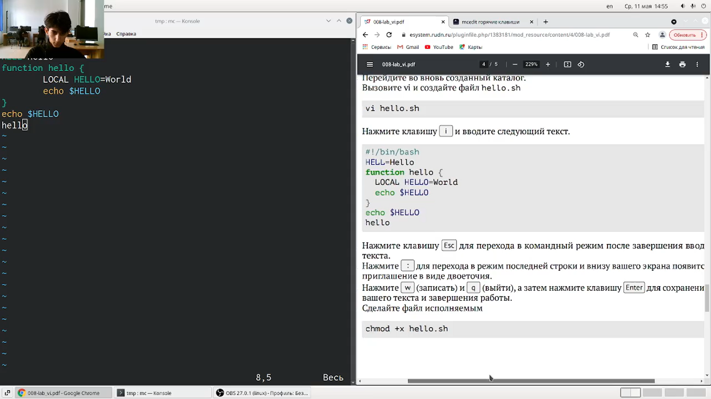
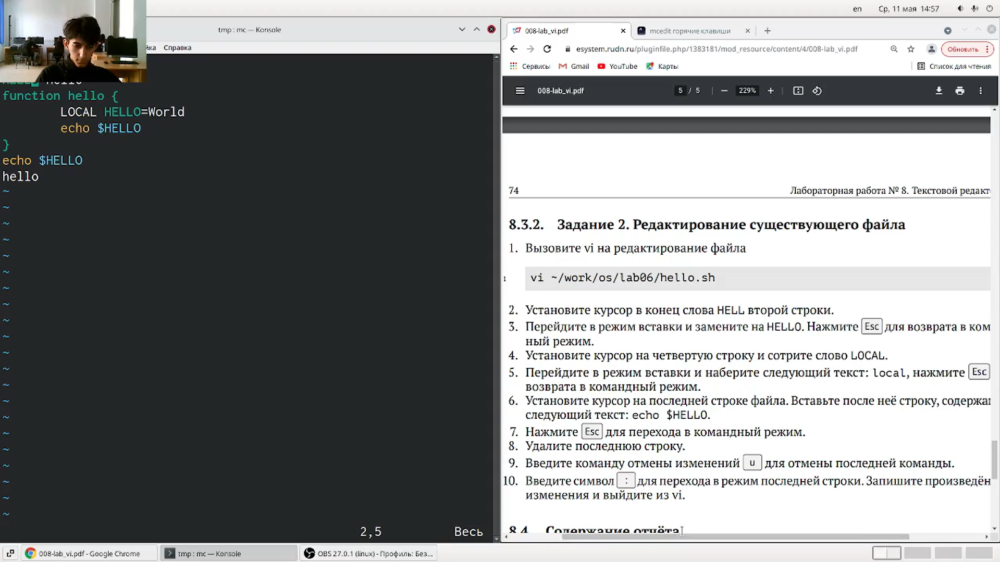
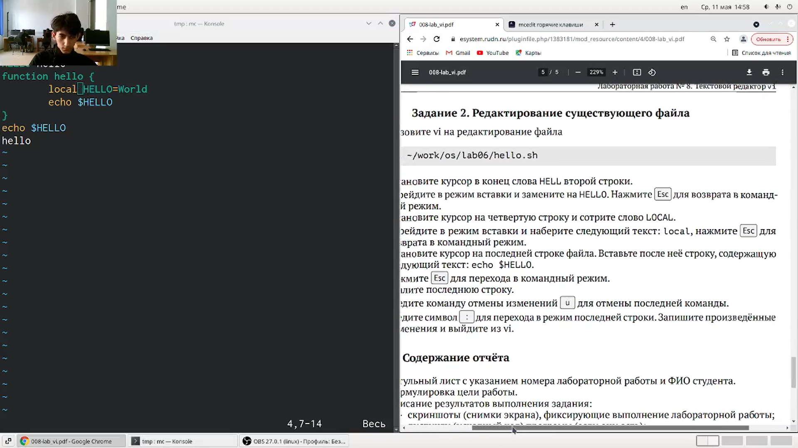

---
## Front matter
lang: ru-RU
title: Презентация к лабораторной работе № 8
author: |
	Leonid A. Sevastianov\inst{1,3}
	\and
	Anton L. Sevastianov\inst{1}
	\and
	Edik A. Ayrjan\inst{2}
	\and
	Anna V. Korolkova\inst{1}
	\and
	Dmitry S. Kulyabov\inst{1,2}
	\and
	Imrikh Pokorny\inst{4}
institute: |
	\inst{1}RUDN University, Moscow, Russian Federation
	\and
	\inst{2}LIT JINR, Dubna, Russian Federation
	\and
	\inst{3}BLTP JINR, Dubna, Russian Federation
	\and
	\inst{4}Technical University of Košice, Košice, Slovakia
date: NEC--2019, 30 September -- 4 October, 2019 Budva, Montenegro

## Formatting
toc: false
slide_level: 2
theme: metropolis
header-includes: 
 - \metroset{progressbar=frametitle,sectionpage=progressbar,numbering=fraction}
 - '\makeatletter'
 - '\beamer@ignorenonframefalse'
 - '\makeatother'
aspectratio: 43
section-titles: true
---

# Цель работы

Познакомиться с операционной системой Linux. Получить практические навыки работы с редактором vi, установленным по умолчанию практически во всех дистрибутивах.

# Выполнение лабораторной работы

### Задание 1
Создал каталог с именем ~/work/os/lab06.

Перешел во вновь созданный каталог.

Вызвал vi и создал файл hello.sh с помощью команды vi hello.sh.

Нажал клавишу i и ввел текст. (рис. [-@fig:001])

{ #fig:001 width=30% }

---

Нажал клавишу Esc для перехода в командный режим после завершения ввода текста. (рис. [-@fig:002])

{ #fig:002 width=30% }

---

Нажал : для перехода в режим последней строки.

Нажал w (записать) и q (выйти), а затем нажал клавишу Esc для сохранения текста и завершения работы.

Сделал файл исполняемым с помощью команды chmod +x hello.sh. (рис. [-@fig:003])

{ #fig:003 width=30% }

---

### Задание 2
Вызвал vi на редактирование файла с помощью команды vi hello.sh.
Установил курсор в конце слова HELL второй строки.
Перешел в режим вставки и заменила на HELLO. Нажал Esc для возврата в командный режим. (рис. [-@fig:004])

{ #fig:004 width=30% }

---

Установил курсор на четвёртую строку и стёр слово LOCAL.
Перешел в режим вставки и набрала следующий текст: local, нажал Esc для возврата в командный режим. (рис. [-@fig:005])

{ #fig:005 width=30% }

---

Установил курсор на последней строке файла. Вставил после неё строку, содержащую следующий текст: echo $HELLO. (рис. [-@fig:006])

{ #fig:006 width=30% }

---

Нажал Esc для перехода в командный режим.
Удалил последнюю строку. (рис. [-@fig:007])

{ #fig:007 width=30% }

---

Ввел команду отмены изменений u для отмены последней команды. (рис. [-@fig:008])

{ #fig:008 width=30% }

---

Ввел символ : для перехода в режим последней строки. Записал произведённые изменения и вышел из vi.

# Выводы

Познакомился с операционной системой Linux. Получил практические навыки работы с редактором vi, установленным по умолчанию практически во всех дистрибутивах.