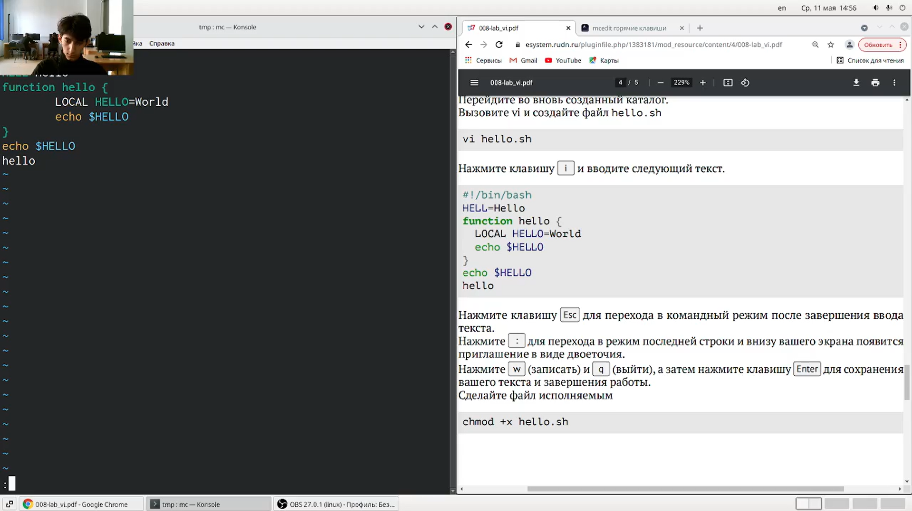
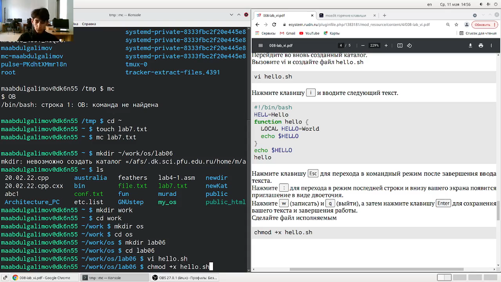
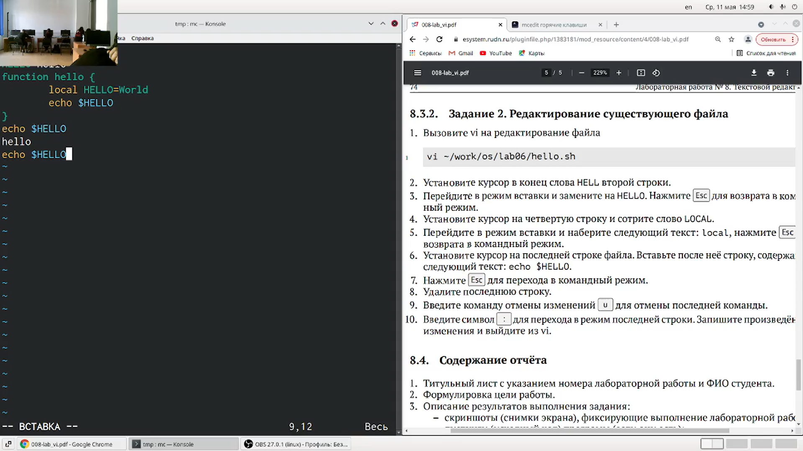
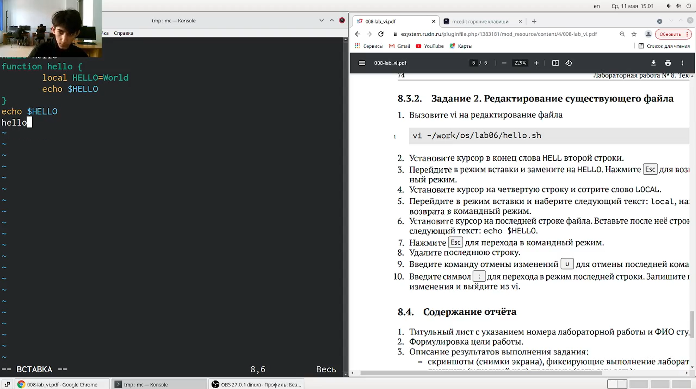
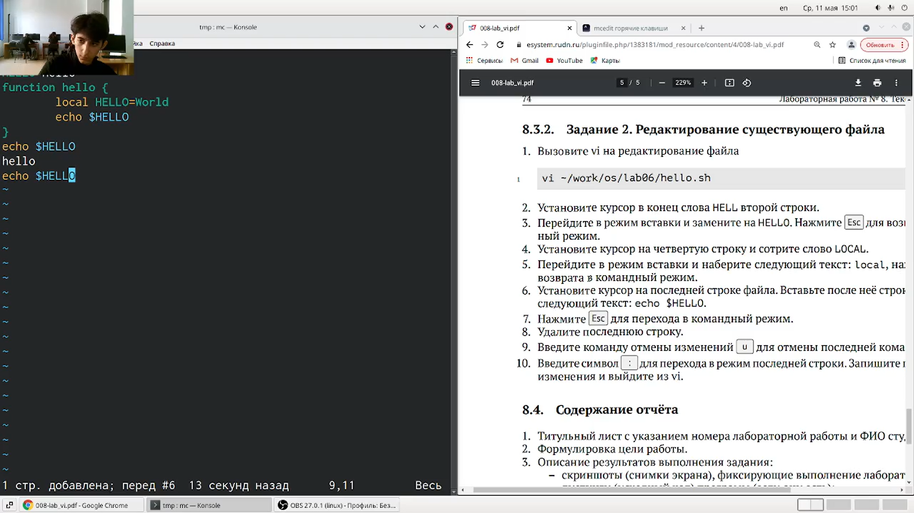

---
## Front matter
title: "Отчет по лабораторной работе № 8"
subtitle: "Российский Университет Дружбы Народов"
author: "Абдулгалимов Мурад"

## Generic otions
lang: ru-RU
toc-title: "Содержание"

## Bibliography
bibliography: bib/cite.bib
csl: pandoc/csl/gost-r-7-0-5-2008-numeric.csl

## Pdf output format
toc: true # Table of contents
toc-depth: 2
lof: true # List of figures
lot: true # List of tables
fontsize: 12pt
linestretch: 1.5
papersize: a4
documentclass: scrreprt
## I18n polyglossia
polyglossia-lang:
  name: russian
  options:
	- spelling=modern
	- babelshorthands=true
polyglossia-otherlangs:
  name: english
## I18n babel
babel-lang: russian
babel-otherlangs: english
## Fonts
mainfont: PT Serif
romanfont: PT Serif
sansfont: PT Sans
monofont: PT Mono
mainfontoptions: Ligatures=TeX
romanfontoptions: Ligatures=TeX
sansfontoptions: Ligatures=TeX,Scale=MatchLowercase
monofontoptions: Scale=MatchLowercase,Scale=0.9
## Biblatex
biblatex: true
biblio-style: "gost-numeric"
biblatexoptions:
  - parentracker=true
  - backend=biber
  - hyperref=auto
  - language=auto
  - autolang=other*
  - citestyle=gost-numeric
## Pandoc-crossref LaTeX customization
figureTitle: "Рис."
tableTitle: "Таблица"
listingTitle: "Листинг"
lofTitle: "Список иллюстраций"
lotTitle: "Список таблиц"
lolTitle: "Листинги"
## Misc options
indent: true
header-includes:
  - \usepackage{indentfirst}
  - \usepackage{float} # keep figures where there are in the text
  - \floatplacement{figure}{H} # keep figures where there are in the text
---

# Цель работы

Познакомиться с операционной системой Linux. Получить практические навыки работы с редактором vi, установленным по умолчанию практически во всех дистрибутивах.

# Задание

### Задание 1
1. Создайте каталог с именем ~/work/os/lab06.
2. Перейдите во вновь созданный каталог.
3. Вызовите vi и создайте файл hello.sh
4. Нажмите на клавишу i и вводите следующий текст:
#!/bin/bash

HELL=Hello

function hello {

LOCAL HELLO=World

echo $HELLO }

echo $HELLO

hello

5. Нажмите клавишу Esc для перехода в командный режим после завершения ввода текста.
6. Нажмите : для перехода в режим последней строки и внизу вашего экрана появится приглашение в виде двоеточия.
7. Нажмите w (записать) и q (выйти), а затем нажмите клавишу Enter для сохранения вашего текста и завершения работы.
8. Сделайте файл исполняемым.
   
### Задание 2

1. Вызовите vi на редактирование файла hello.sh.
2. Установите курсор в конец слова HELL второй строки.
3. Перейдите в режим вставки и замените на HELLO. 4. Нажмите Esc для возврата в командный режим.
5. Установите курсор на четвёртую строку и сотрите слово LOCAL.
6. Перейдите в режим вставки и наберите следующий текст: local, нажмите Esc для возврата в командный режим.
7. Установите курсор на последней строке файла Вставьте после неё строку, содержащую следующий текст: echo $HELLO.
Нажмите Ecs для перехода в командный режим.
8. Удалите последнюю строку.
9. Введите команду отмены изменений u для отмены последней команды.
10. Введите символ : для перехода в режим последней строки. Запишите произведённые изменения и выйдите из vi.

# Выполнение лабораторной работы

### Задание 1
Создал каталог с именем ~/work/os/lab06.

Перешел во вновь созданный каталог.

Вызвал vi и создал файл hello.sh с помощью команды vi hello.sh.

Нажал клавишу i и ввел текст. (рис. [-@fig:001])

{ #fig:001 width=70% }

Нажал клавишу Esc для перехода в командный режим после завершения ввода текста. (рис. [-@fig:002])

{ #fig:002 width=70% }

Нажал : для перехода в режим последней строки.

Нажал w (записать) и q (выйти), а затем нажал клавишу Esc для сохранения текста и завершения работы.

Сделал файл исполняемым с помощью команды chmod +x hello.sh. (рис. [-@fig:003])

{ #fig:003 width=70% }

### Задание 2
Вызвал vi на редактирование файла с помощью команды vi hello.sh.
Установил курсор в конце слова HELL второй строки.
Перешел в режим вставки и заменила на HELLO. Нажал Esc для возврата в командный режим. (рис. [-@fig:004])

{ #fig:004 width=70% }

Установил курсор на четвёртую строку и стёр слово LOCAL.
Перешел в режим вставки и набрала следующий текст: local, нажал Esc для возврата в командный режим. (рис. [-@fig:005])

{ #fig:005 width=70% }

Установил курсор на последней строке файла. Вставил после неё строку, содержащую следующий текст: echo $HELLO. (рис. [-@fig:006])

{ #fig:006 width=70% }

Нажал Esc для перехода в командный режим.
Удалил последнюю строку. (рис. [-@fig:007])

{ #fig:007 width=70% }

Ввел команду отмены изменений u для отмены последней команды. (рис. [-@fig:008])

{ #fig:008 width=70% }

Ввел символ : для перехода в режим последней строки. Записал произведённые изменения и вышел из vi.

# Контрольные вопросы

Командный режим предназначен для ввода команд редактирования и навигации по редактируемому файлу; режим вставки предназначен для ввода содержания редактируемого файла; режим последней (командной) строки используется для записи изменений в файл и выхода из редактора.

Перейти в режим последней строки: находясь в командном режиме, нажать двоеточие и набрать символ q.

Команды позиционирования:

0 (ноль) — переход в начало строки;
$ — переход в конец строки;
G — переход в конец файла;
n G — переход на строку с номером n.
Строка символов, которая может включать в себя буквы, цифры и символы подчёркивания.

0 (ноль) - перейти в начало строки; $ - перейти в конец строки;

Вставка текста:

а — вставить текст после курсора;
А — вставить текст в конец строки;
i — вставить текст перед курсором;
n i — вставить текст n раз;
I — вставить текст в начало строки.
Вставка строки:

о — вставить строку под курсором;
О — вставить строку над курсором.
Удаление текста:

x — удалить один символ в буфер;
d w — удалить одно слово в буфер;
d $ — удалить в буфер текст от курсора до конца строки;
d 0 — удалить в буфер текст от начала строки до позиции курсора;
d d — удалить в буфер одну строку;
n d d — удалить в буфер n строк.
Отмена и повтор произведённых изменений:

u — отменить последнее изменение;
. — повторить последнее изменение.
Копирование текста в буфер:

Y — скопировать строку в буфер;
n Y — скопировать n строк в буфер;
y w — скопировать слово в буфер.
Вставка текста из буфера:

p — вставить текст из буфера после курсора;
P — вставить текст из буфера перед курсором.
Замена текста:

c w — заменить слово;
n c w — заменить n слов;
c $ — заменить текст от курсора до конца строки;
r — заменить слово;
R — заменить текст.
Поиск текста:

/ текст — произвести поиск вперёд по тексту указанной строки символов;
? текст — произвести поиск назад по тексту указанной строки символов.
Команды редактирования в режиме командной строки.

Копирование и перемещение текста:

: n,m d — удалить строки с n по m;
: i,j m k — переместить строки с i по j, начиная со строки k;
: i,j t k — копировать строки с i по j в строку k;
: i,j w имя-файла — записать строки с i по j в файл с именем имя-файла.
Запись в файл и выход из редактора:

: w — записать изменённый текст в файл, не выходя из vi;
: w имя-файла — записать изменённый текст в новый файл с именем имяфайла;
: w ! имя-файла — записать изменённый текст в файл с именем имяфайла;
: w q — записать изменения в файл и выйти из vi;
: q — выйти из редактора vi;
: q ! — выйти из редактора без записи;
: e ! — вернуться в командный режим, отменив все изменения, произведённые со времени последней записи.
c$ - заменить текст от курсора до конца строки.

u- отменить последнее изменение.

Kопирование и перемещение текста:

:n,m d-уничтожить строки с n по m
: i,j m k- переместить строки с i по j , начиная со строки k
: i,j t k- копировать строки с i по j на строку k
: i,j w <имя_файла>- записать строки с i по j в файл с именем <имя_файла>
Запись в файл и выход из редактора:

:w- записать измененный текст в файл на диске, не выходя из Vi;
:w - записать измененный текст в новый файл с именем ;
:w! <имя_файла>- записать измененный текст в файл с именем<имя_файла> ; -
:wq- записать изменения в файл и выйти из Vi;
:q- выйти из редактора Vi;
:q!- выйти из редактора без записи;
:e!- вернуться в командный режим, отменив все изменения,произведенные со времени последней записи.
Командой $.

: set all - вывести полный список опций.

Нажатие клавиши Esc всегда переводит vi в командный. Если Вы нажмете клавишу Esc, находясь в командном режиме, машина напомнит вам об этом, подав звуковой сигнал.

Командный –> вставки– > последняя строка (командная строка).

# Выводы

Познакомился с операционной системой Linux. Получил практические навыки работы с редактором vi, установленным по умолчанию практически во всех дистрибутивах.

# Список литературы{.unnumbered}

::: {#refs}
:::
