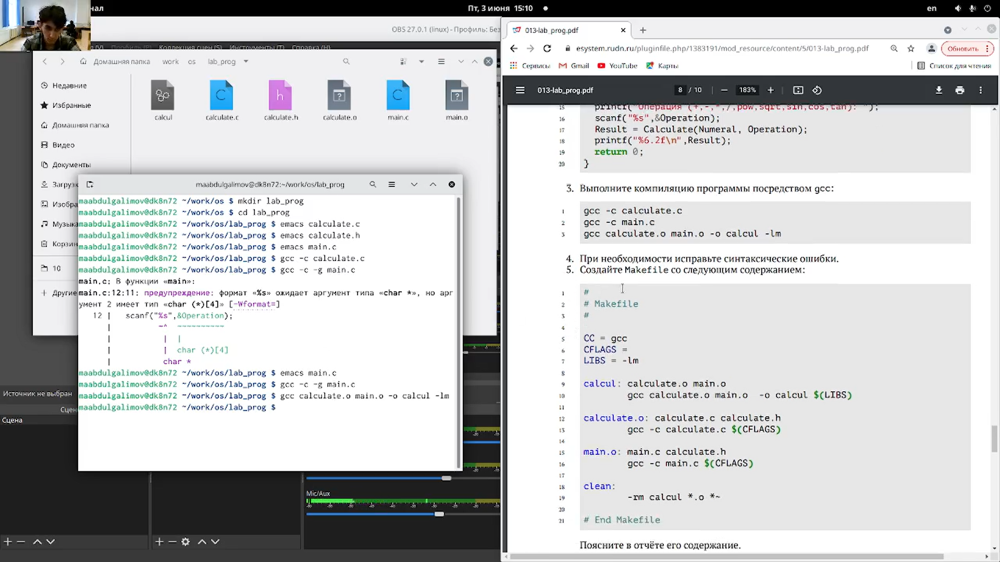
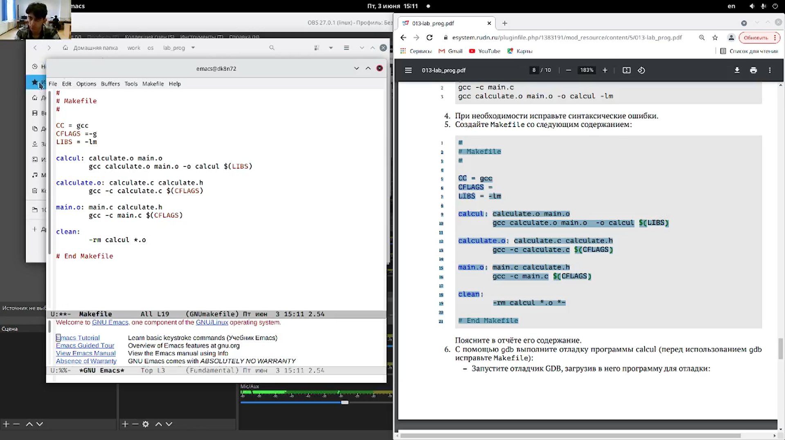
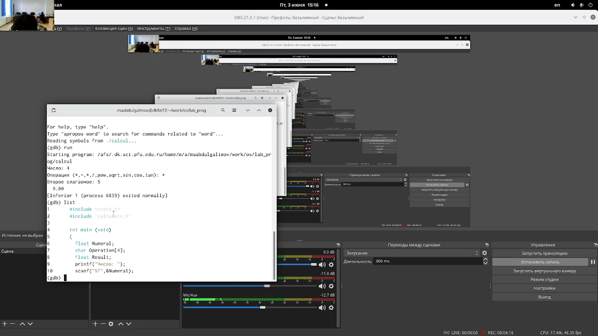
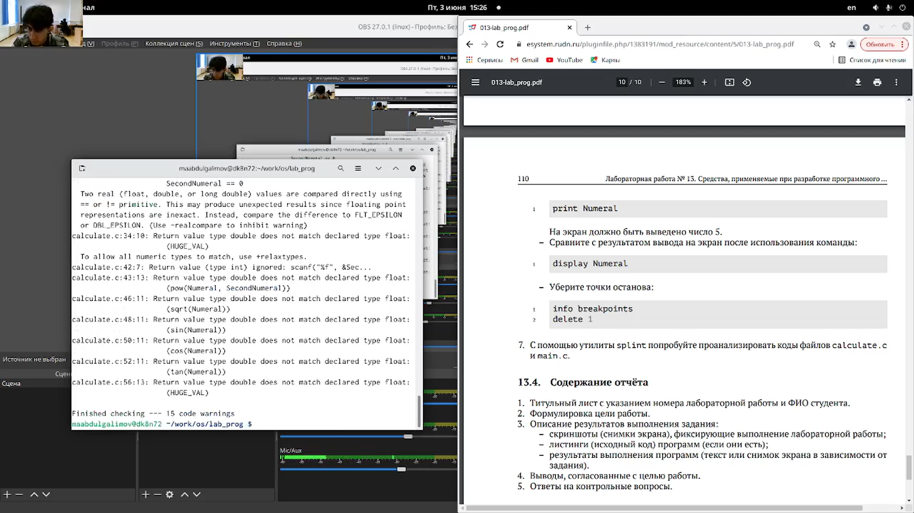

---
## Front matter
lang: ru-RU
title: Презентация по лабораторной работе №13
author: |
	Leonid A. Sevastianov\inst{1,3}
	\and
	Anton L. Sevastianov\inst{1}
	\and
	Edik A. Ayrjan\inst{2}
	\and
	Anna V. Korolkova\inst{1}
	\and
	Dmitry S. Kulyabov\inst{1,2}
	\and
	Imrikh Pokorny\inst{4}
institute: |
	\inst{1}RUDN University, Moscow, Russian Federation
	\and
	\inst{2}LIT JINR, Dubna, Russian Federation
	\and
	\inst{3}BLTP JINR, Dubna, Russian Federation
	\and
	\inst{4}Technical University of Košice, Košice, Slovakia
date: NEC--2019, 30 September -- 4 October, 2019 Budva, Montenegro

## Formatting
toc: false
slide_level: 2
theme: metropolis
header-includes: 
 - \metroset{progressbar=frametitle,sectionpage=progressbar,numbering=fraction}
 - '\makeatletter'
 - '\beamer@ignorenonframefalse'
 - '\makeatother'
aspectratio: 43
section-titles: true
---

# Цель работы

Приобрести простейшие навыки разработки, анализа, тестирования и отладки приложений в ОС типа UNIX/Linux на примере создания на языке программирования
С калькулятора с простейшими функциями.

# Выполнение лабораторной работы

### В домашнем каталоге создал подкаталог ~/work/os/lab_prog (рис. [-@fig:001])

{ #fig:001 width=30% }

---

### Создал в нём файлы: calculate.h, calculate.c, main.c (рис. [-@fig:002])

{ #fig:002 width=30% }

---

### Выполнил компиляцию программы посредством gcc:
gcc -c calculate.c
gcc -c main.c
gcc calculate.o main.o -o calcul -lm (рис. [-@fig:003])

{ #fig:003 width=30% }

---

### Создал Makefile (рис. [-@fig:004])

{ #fig:004 width=30% }

---

### С помощью gdb выполнил отладку программы calcul (перед использованием gdb исправьте Makefile):
Запустил отладчик GDB, загрузив в него программу для отладки: gdb ./calcul
Для постраничного (по 9 строк) просмотра исходного код использовал команду list
Сравнил с результатом вывода на экран после использования команды: display Numeral – Убрал точки останова: info breakpoints delete 1 (рис. [-@fig:005])

{ #fig:005 width=30% }

---

### Установил утилиту splint. (рис. [-@fig:006])

{ #fig:006 width=30% }

# Выводы

Приобрел простейшие навыки разработки, анализа, тестирования и отладки приложений в ОС типа UNIX/Linux на примере создания на языке программирования
С калькулятора с простейшими функциями.